# OAuth2.0 客户端

**有第三方登录**这么一个业务场景，渐渐明白OAuth2的一些使用场景，也逐渐的去慢慢直观地理解了这么一项技术。

## **第三方登录的业务实现**

我们在登录小红书Web端进行登录时，会出现如下弹窗：

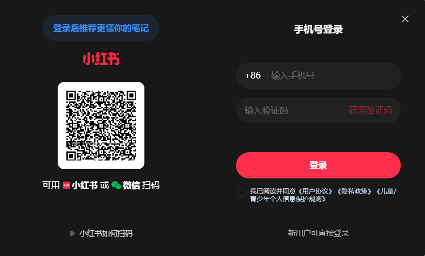左侧可以使用微信进行扫码

此时右侧手机号验证码登录其实已经很熟悉了：我们可以在小红书后端的数据库内根据手机号来关联用户信息。

但是左侧的微信登录，又是如何获取我们用户在微信那边的数据，**使得小红书能够使用我微信的身份**，和小红书的用户信息进行关联呢？

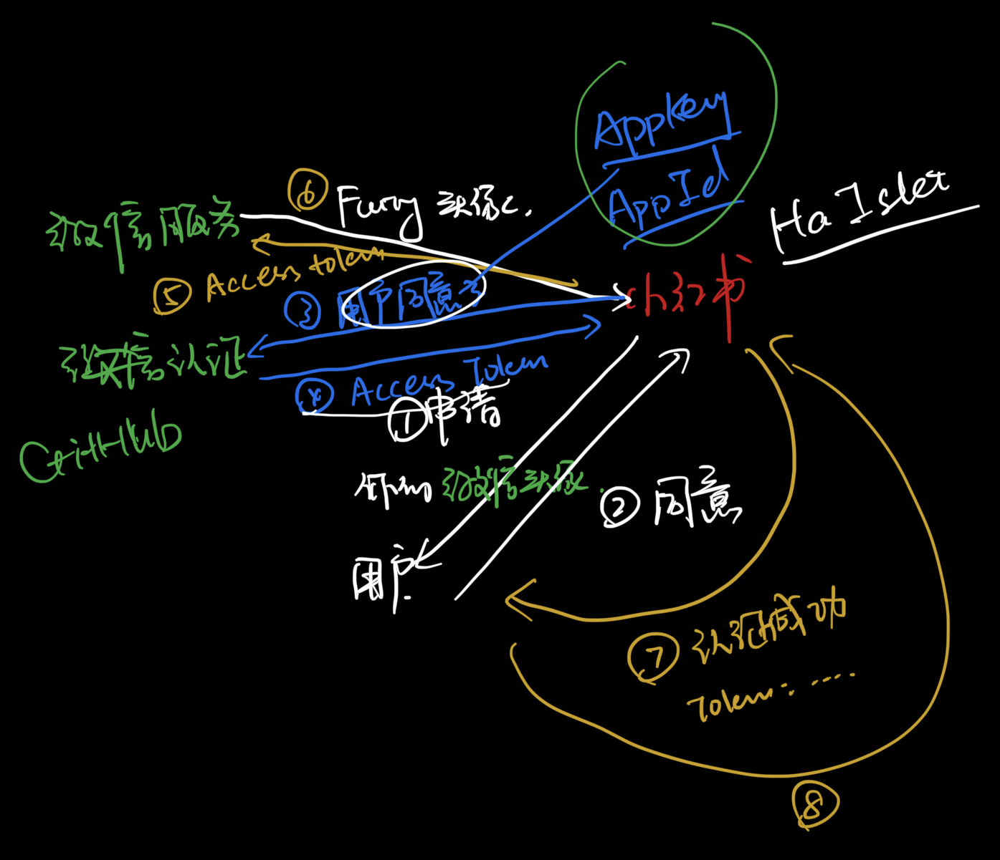一张第三方认证的草图


好像有点乱…… 让我们从头开始画一下吧

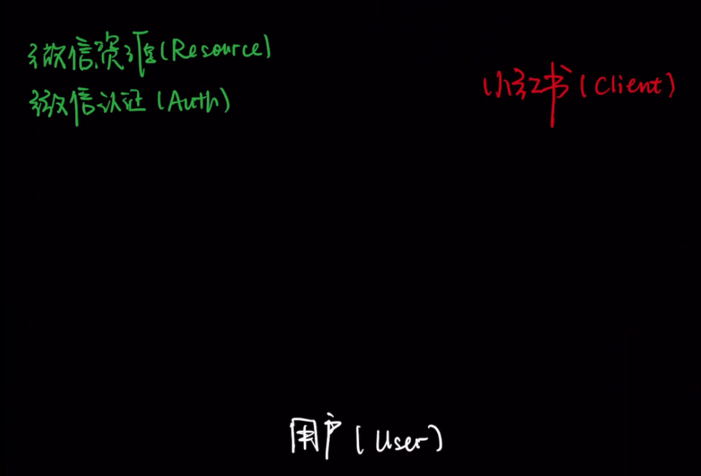

首先 **用户扎西拉姆**扫描二维码 微信会载入**小红书网页页面**，**小红书(Client)** 提示**用户**申请获取用户**扎西拉姆的微信头像等微信信息**

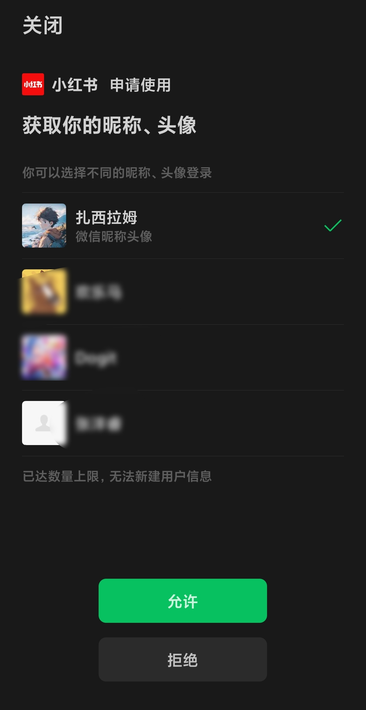

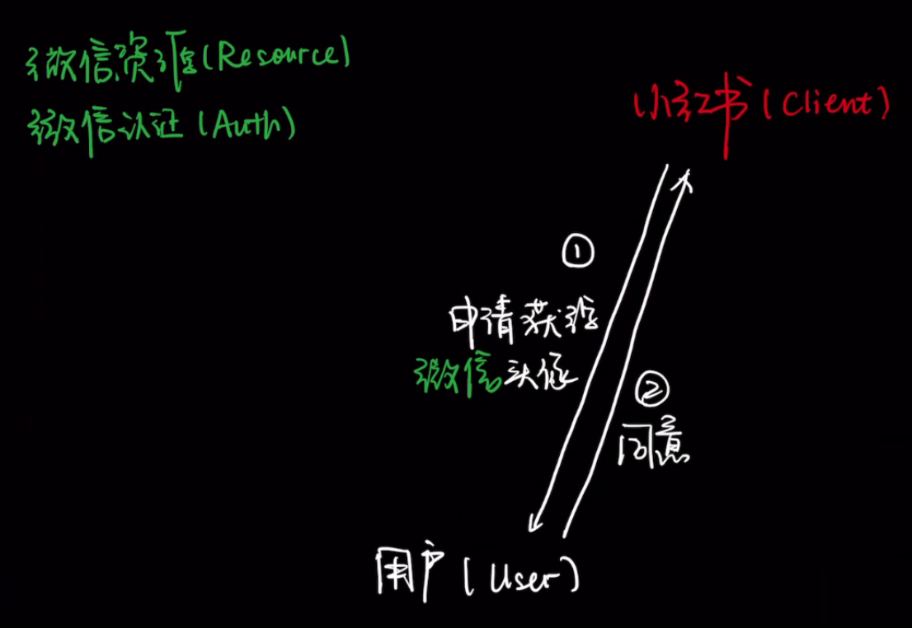步骤1、2：小红书向用户发送申请获得微信头像的申请

如果**用户扎西拉姆**允许，则**小红书**则告诉**微信认证Auth模块**：**用户扎西拉姆同意**了！快把用户信息给我！

**微信认证**看了看**小红书**：……你谁啊？凭什么要把扎西拉姆的头像给你这个不相干的第三方客户端？

**小红书**：我有我的**Client Id 和 Client Secret** ，这可是你一开始在我注册的时候就给我的，拿着这两个就能认识我！

**微信认证**：好的，给你**小红书**对应权限的 **门票 Access Token** ！拿着它你就可以到**资源领取处**领取扎西拉姆的用户信息了！（但是这个门票只能给你扎西拉姆的昵称、头像、微信号哦！）

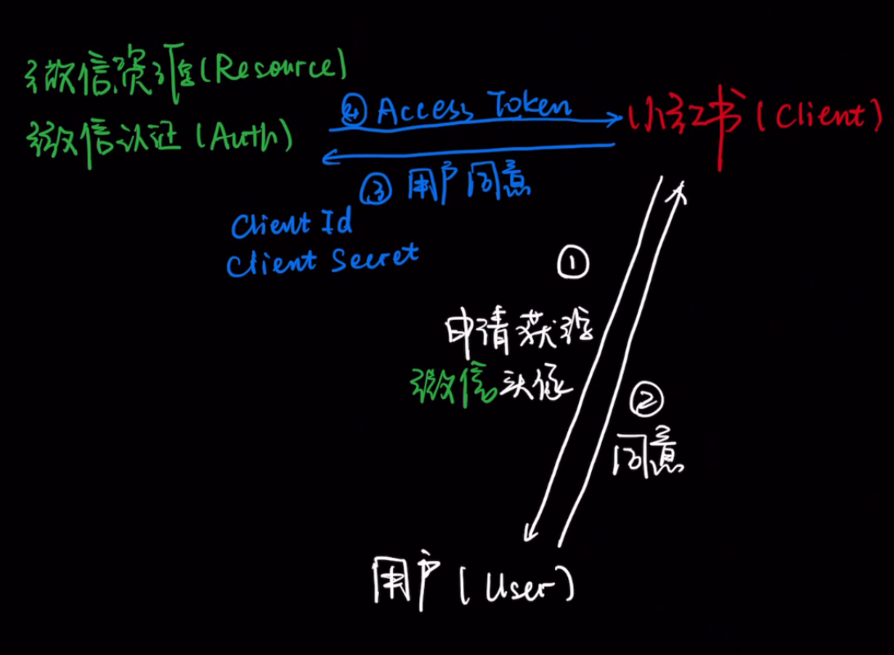步骤3、4：小红书获取 Access Token

于是凭借着这个 **Access Token**，小红书成功在资源处拿到了**用户扎西拉姆的个人信息**，并验证了一下扎西拉姆的手机号，和**自己数据库里的用户ID**进行了对应，小红书的后端用扎西拉姆的ID生成了访问小红书资源的 **Client Token**，即我们之前正常登录注册所说的token。

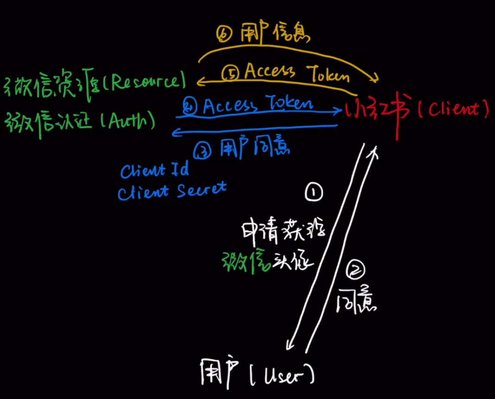步骤5、6：小红书获取扎西拉姆的微信信息，与小红书内部数据进行对应，生成id

之后扎西拉姆用微信进行登录，就可以获得自己用户的**Client Token**，在小红书进行权限认证，可以查看自己小红书的信息啦！

步骤7、8：使用Client Token获取扎西拉姆的小红书资源

除了微信登录，我们还可以为不同的客户端做支付宝登录、微软登录、Google登录、Github登录……

而一个技术协议就可以完美的实现以上的所有流程：OAuth2.0


## OAuth2.0 的概念描述

OAuth 2.0的运行流程如下图，摘自RFC 6749。

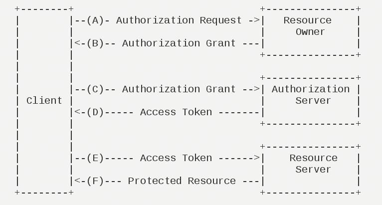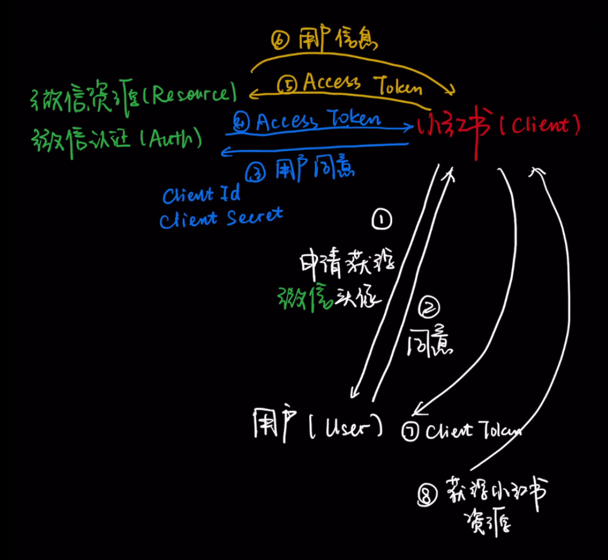对比一下这两张图，你会发现上图 A-F 正好一一对应下图前六步

这里：

- 小红书是 Client
- 用户扎西拉姆 是 Resource Owner
- 微信认证Auth模块 是 Authorization Server
- 微信资源服务模块 就是 Resource Server


OAuth2一种最常见的授权模式是授权码模式（authorization code），下图是授权码模式的一种示例，将开始操作到获取Access Token（即黑图示的前4步）进行了详细描述：


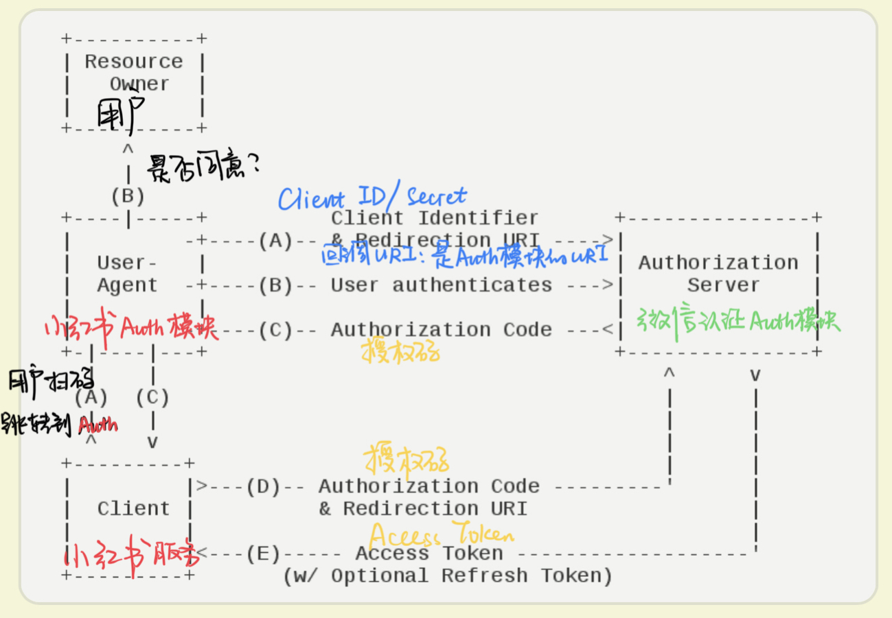

首先，**小红书的Auth模块**在开发时就要确定好两件事：**Client Identifier（包括Id 和 Secret）、重定向URI**

一般而言，**Client Id 和 Client Secret**需要先手动向**微信认证Auth模块**申请，配置，然后将其配在**小红书Auth模块**的代码里或服务器环境内；

这里**重定向URI**即用户访问**小红书Auth模块**的地址，假如**小红书Auth模块**在本地，**微信Auth模块**就会让用户访问 `http://localhost:8080/authExample/example?authCode=examplecode`


（A）用户访问客户端，后者将前者导向认证服务器。

项目运行上线后，当用户扫描小红书上的微信登录二维码，微信首先会解析二维码，二维码内容会打开**小红书Auth模块**的网页


（B）用户选择是否给予客户端授权。

用户选择选取一个身份进行**小红书的登录**，如可以选择“扎西拉姆”、“欢乐马”、“Furry”等不同身份。


（C）假设用户给予授权，认证服务器将用户导向客户端事先指定的**"重定向URI"（redirection URI）**，同时附上一个授权码。

比如说**微信Auth模块**就会让用户访问 `http://小红书Auth:8080/authExample/example?authCode=examplecode` ，这里 `authCode` **就是授权码**，**小红书的Auth模块**就可以把**授权码**给到**小红书其他服务模块**（下称**小红书Client**）


（D）客户端收到授权码，向认证服务器申请令牌。这一步是在客户端的后台的服务器上完成的，对用户不可见。

（E）认证服务器核对了授权码和重定向URI，确认无误后，向客户端发送**访问令牌（access token）和更新令牌（refresh token）**。

**小红书Client模块**用 **authCode**  来获取**微信认证模块的**令牌，**微信认证Auth模块**在确认无误后就向**小红书Client**发送 **Access Token 和 Refresh Token。**


## 前后端不分离示例

由于方便考虑，我们将以上流程简化：

- 第三方服务端（Auth、Resource模块）使用现有的Github服务端，即我们做的都是Github第三方登录
- 客户端的Auth模块（User Agent）和Client模块不分开，放在一个模块内，就是我们所做的示例。

至于为什么使用Github作为服务端，因为它的Client Id 和 Client Secret非常方便获取，不需要任何材料。（可以认为只要网站想，任何网站都可以用Github登录）。所以可以用它来做示例，以下服务端均为Github，其他的服务端大同小异，都可以按照它的官方文档进行接入。

由于有重定向URI的存在，使用前后端一体的客户端Web服务是入门的最佳选择，以下是几个集成度较高的案例。

### Springboot + SpringSecurity (GitHub) + Thymeleaf

客户端创建 Springboot 工程，示例 JDK17 + Springboot3.2.5 ，项目结构与源码如下：

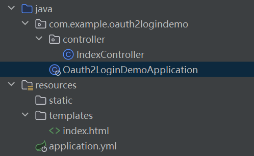项目结构

```xml
<?xml version="1.0" encoding="UTF-8"?>
<project xmlns="http://maven.apache.org/POM/4.0.0" xmlns:xsi="http://www.w3.org/2001/XMLSchema-instance"
         xsi:schemaLocation="http://maven.apache.org/POM/4.0.0 https://maven.apache.org/xsd/maven-4.0.0.xsd">
    <modelVersion>4.0.0</modelVersion>
    <parent>
        <groupId>org.springframework.boot</groupId>
        <artifactId>spring-boot-starter-parent</artifactId>
        <version>3.2.5</version>
        <relativePath/> <!-- lookup parent from repository -->
    </parent>
    <groupId>com.example</groupId>
    <artifactId>oauth2-login-demo</artifactId>
    <version>0.0.1-SNAPSHOT</version>
    <name>oauth2-login-demo</name>
    <description>oauth2-login-demo</description>
    <properties>
        <java.version>17</java.version>
    </properties>
    <dependencies>
        <dependency>
            <groupId>org.springframework.boot</groupId>
            <artifactId>spring-boot-starter-oauth2-client</artifactId>
        </dependency>
        <dependency>
            <groupId>org.springframework.boot</groupId>
            <artifactId>spring-boot-starter-security</artifactId>
        </dependency>
        <dependency>
            <groupId>org.springframework.boot</groupId>
            <artifactId>spring-boot-starter-thymeleaf</artifactId>
        </dependency>
        <dependency>
            <groupId>org.springframework.boot</groupId>
            <artifactId>spring-boot-starter-web</artifactId>
        </dependency>
        <dependency>
            <groupId>org.thymeleaf.extras</groupId>
            <artifactId>thymeleaf-extras-springsecurity6</artifactId>
        </dependency>
        <dependency>
            <groupId>org.springframework.boot</groupId>
            <artifactId>spring-boot-starter-test</artifactId>
            <scope>test</scope>
        </dependency>
        <dependency>
            <groupId>org.springframework.security</groupId>
            <artifactId>spring-security-test</artifactId>
            <scope>test</scope>
        </dependency>
    </dependencies>
    <build>
        <plugins>
            <plugin>
                <groupId>org.springframework.boot</groupId>
                <artifactId>spring-boot-maven-plugin</artifactId>
            </plugin>
        </plugins>
    </build>

</project>
```

Maven 依赖

```yaml
spring:
  security:
    oauth2:
      client:
        registration:
          github:
            client-id: Ov2********
            client-secret: 9773**************
```

application.yml

```html
<!DOCTYPE html>
<html xmlns="http://www.w3.org/1999/xhtml" xmlns:th="https://www.thymeleaf.org" xmlns:sec="https://www.thymeleaf.org/thymeleaf-extras-springsecurity5">
<head>
    <title>Spring Security - OAuth 2.0 Login</title>
    <meta charset="utf-8" />
</head>

<body>
<div style="float: right" th:fragment="logout" sec:authorize="isAuthenticated()">
    <div style="float:left">
        <span style="font-weight:bold">User: </span><span sec:authentication="name"></span>
    </div>
    <div style="float:none">&nbsp;</div>
    <div style="float:right">
        <form action="#" th:action="@{/logout}" method="post">
            <input type="submit" value="Logout" />
        </form>
    </div>
</div>

<h1>OAuth 2.0 Login with Spring Security</h1>

<div>
    You are successfully logged in <span style="font-weight:bold" th:text="${userName}"></span>
    via the OAuth 2.0 Client <span style="font-weight:bold" th:text="${clientName}"></span>
</div>

<div>&nbsp;</div>
<div>
    <span style="font-weight:bold">User Attributes:</span>
    <ul>
        <li th:each="userAttribute : ${userAttributes}">
            <span style="font-weight:bold" th:text="${userAttribute.key}"></span>: <span th:text="${userAttribute.value}"></span>
        </li>
    </ul>
</div>
</body>
</html>
```

index.html 使用了 Thymeleaf

```java
package com.example.oauth2logindemo.controller;

import org.springframework.security.config.oauth2.client.CommonOAuth2Provider;
import org.springframework.security.core.annotation.AuthenticationPrincipal;
import org.springframework.security.oauth2.client.OAuth2AuthorizedClient;
import org.springframework.security.oauth2.client.annotation.RegisteredOAuth2AuthorizedClient;
import org.springframework.security.oauth2.core.user.OAuth2User;
import org.springframework.stereotype.Component;
import org.springframework.stereotype.Controller;
import org.springframework.ui.Model;
import org.springframework.web.bind.annotation.GetMapping;

@Controller
public class IndexController {
    @GetMapping("/")
    public String index(
            Model model,
            @RegisteredOAuth2AuthorizedClient OAuth2AuthorizedClient authorizedClient,
            @AuthenticationPrincipal OAuth2User oauth2User
    ) {
        model.addAttribute("userName", oauth2User.getName());
        model.addAttribute("clientName", authorizedClient.getClientRegistration().getClientName());
        model.addAttribute("userAttributes", oauth2User.getAttributes());
        return "index";
    }
}
```

IndexController.java


```java
package com.example.oauth2logindemo;

import org.springframework.boot.SpringApplication;
import org.springframework.boot.autoconfigure.SpringBootApplication;

@SpringBootApplication
public class Oauth2LoginDemoApplication {
    public static void main(String[] args) {
        SpringApplication.run(Oauth2LoginDemoApplication.class, args);
    }
}
```

Oauth2LoginDemoApplication.java

上文的 ClientId 和 ClientSecret的获取方式：


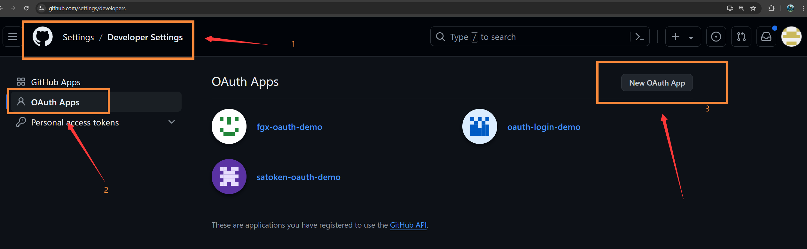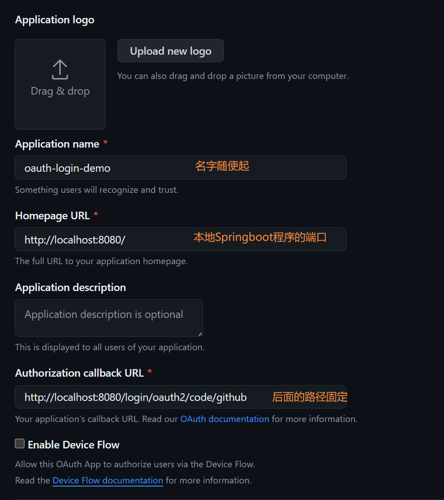

运行该Springboot程序，访问 http://localhost:8080/login 会出现“Github登录”按钮 ，之后会跳转到如下界面：

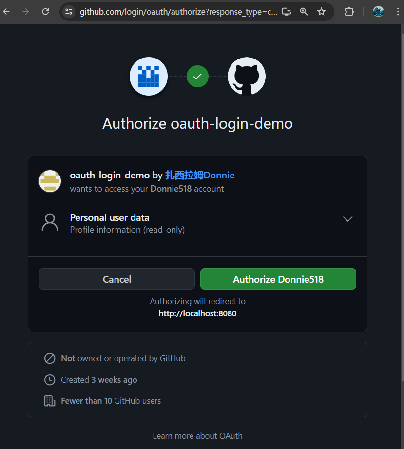Github认证界面

点击 Authorize 会跳转到 [localhost:8080](http://localhost:8080)

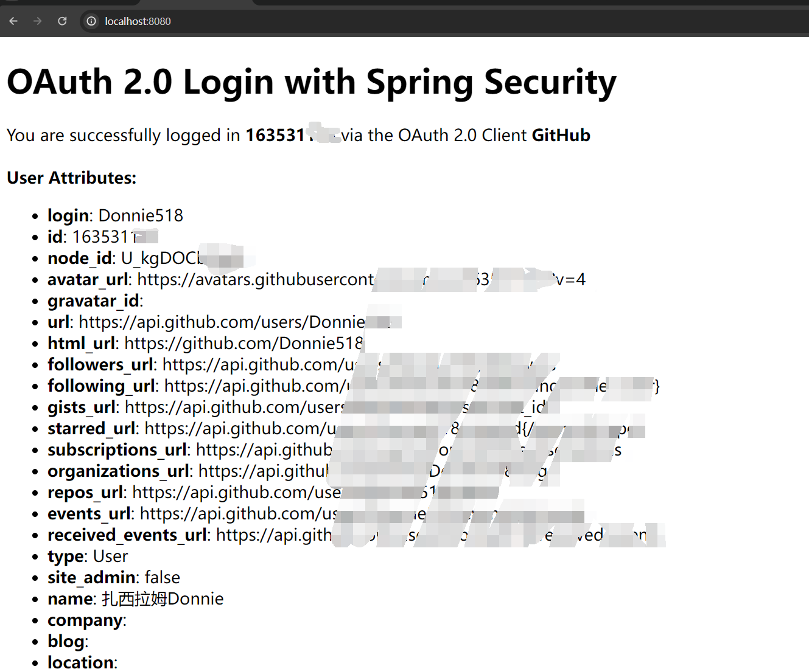得到了Github的个人信息

这种方式是最简单的，也是封装程度最高的，可以说我们在配置以上内容的过程中几乎没有用到什么AccessToken、甚至重定向URI都是Spring Security 帮我们配好的；我们需要另一种更详细一点的实现：


### Springboot + satoken + Thymeleaf（待补充）

sa-token 的Client端给了一个示例源码：https://gitee.com/dromara/sa-token/tree/master/sa-token-demo/sa-token-demo-oauth2/sa-token-demo-oauth2-client


### 


## 参考

1. 阮一峰的网络日志 理解OAuth2.0 https://www.ruanyifeng.com/blog/2014/05/oauth_2_0.html