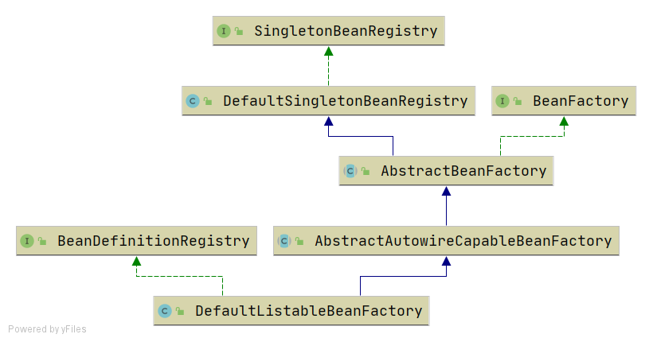

# 简单的bean容器

# IoC容器概念

[https://github.com/DerekYRC/mini-spring](https://github.com/DerekYRC/mini-spring)

## 基本概念

使用Bean容器去管理一个个的Bean，通过`BeanFactory`将创建对象与使用对象的业务代码解耦，把Bean的管理交给容器，业务开发人员无须去关心Bean的构建和生命周期管理。

## 组成结构

- 一个部件去对应Bean内存的映射
- 从外部XML文件获取Bean的声明
- 反射部件加载Bean Class并创建实例
- 一个Map保存Bean的实例
- 对外提供`getBean()`方法供外部使用

# 简易的IoC容器的实现

## BeanFactory

> simple-bean-container
> 

定义一个简单的bean容器BeanFactory，内部包含一个map用以保存bean，只有注册bean和获取bean两个方法

```java
public class BeanFactory {
	private Map<String, Object> beanMap = new HashMap<>();

	public void registerBean(String name, Object bean) {
		beanMap.put(name, bean);
	}

	public Object getBean(String name) {
		return beanMap.get(name);
	}
}
```

## Bean的定义

> simple-bean-container
> 
- BeanDefinition，顾名思义，用于定义bean信息的类，包含bean的class类型、构造参数、属性值等信息，每个bean对应一个BeanDefinition的实例。
- BeanDefinitionRegistry，BeanDefinition注册表接口，定义注册BeanDefintion的方法。它维护了 Bean 定义和 Bean 名称之间的映射关系。
- SingletonBeanRegistry及其实现类DefaultSingletonBeanRegistry，定义添加和获取单例bean的方法。
    
    
    

## Bean的实例化

> instantiation-strategy
> 

针对bean的实例化，抽象出一个实例化策略的接口InstantiationStrategy，有两个实现类：

- SimpleInstantiationStrategy，使用bean的构造函数来实例化

```java
public class SimpleInstantiationStrategy implements InstantiationStrategy {

	/**
	 * 简单的bean实例化策略，根据bean的无参构造函数实例化对象
	 *
	 * @param beanDefinition
	 * @return
	 * @throws BeansException
	 */
	@Override
	public Object instantiate(BeanDefinition beanDefinition) throws BeansException {
		Class beanClass = beanDefinition.getBeanClass();
		try {
			Constructor constructor = beanClass.getDeclaredConstructor();
			return constructor.newInstance();
		} catch (Exception e) {
			throw new BeansException("Failed to instantiate [" + beanClass.getName() + "]", e);
		}
	}
}
```

- CglibSubclassingInstantiationStrategy，使用CGLIB动态生成子类

```java
public class CglibSubclassingInstantiationStrategy implements InstantiationStrategy {

	/**
	 * 使用CGLIB动态生成子类
	 *
	 * @param beanDefinition
	 * @return
	 * @throws BeansException
	 */
	@Override
	public Object instantiate(BeanDefinition beanDefinition) throws BeansException {
	//Enhancer对象，它是整个 CGLIB 动态代理和字节码增强操作的核心工具
		Enhancer enhancer = new Enhancer();
		enhancer.setSuperclass(beanDefinition.getBeanClass());
		//为生成的子类设置了方法拦截回调逻辑。匿名的MethodInterceptor实现，是在子类方法被调用时，直接调用父类对应的方法
		enhancer.setCallback((MethodInterceptor) (obj, method, argsTemp, proxy) -> proxy.invokeSuper(obj,argsTemp));
		return enhancer.create();
	}
}
```

## 为Bean填充属性

> populate-bean-with-property-values
> 

```java
public class PopulateBeanWithPropertyValuesTest {

	@Test
	public void testPopulateBeanWithPropertyValues() throws Exception {
		DefaultListableBeanFactory beanFactory = new DefaultListableBeanFactory();
		PropertyValues propertyValues = new PropertyValues();
		propertyValues.addPropertyValue(new PropertyValue("name", "derek"));
		propertyValues.addPropertyValue(new PropertyValue("age", 18));
		BeanDefinition beanDefinition = new BeanDefinition(Person.class, propertyValues);
		beanFactory.registerBeanDefinition("person", beanDefinition);

		Person person = (Person) beanFactory.getBean("person");
		System.out.println(person);
		assertThat(person.getName()).isEqualTo("derek");
		assertThat(person.getAge()).isEqualTo(18);
	}
}
```

```java
protected void applyPropertyValues(String beanName, Object bean, BeanDefinition beanDefinition) {
		try {
			for (PropertyValue propertyValue : beanDefinition.getPropertyValues().getPropertyValues()) {
				String name = propertyValue.getName();
				Object value = propertyValue.getValue();

				//通过反射设置属性
				BeanUtil.setFieldValue(bean, name, value);
			}
		} catch (Exception ex) {
			throw new BeansException("Error setting property values for bean: " + beanName, ex);
		}
	}
```

## 为Bean注入Bean

> populate-bean-with-bean
> 

增加BeanReference类，包装一个bean对另一个bean的引用。实例化beanA后填充属性时，若PropertyValue#value为BeanReference，引用beanB，则先去实例化beanB。 

```java
public class PopulateBeanWithPropertyValuesTest {

	/**
	 * 为bean注入bean
	 *
	 * @throws Exception
	 */
	@Test
	public void testPopulateBeanWithBean() throws Exception {
		DefaultListableBeanFactory beanFactory = new DefaultListableBeanFactory();

		//注册Car实例
		PropertyValues propertyValuesForCar = new PropertyValues();
		propertyValuesForCar.addPropertyValue(new PropertyValue("brand", "porsche"));
		BeanDefinition carBeanDefinition = new BeanDefinition(Car.class, propertyValuesForCar);
		beanFactory.registerBeanDefinition("car", carBeanDefinition);

		//注册Person实例
		PropertyValues propertyValuesForPerson = new PropertyValues();
		propertyValuesForPerson.addPropertyValue(new PropertyValue("name", "derek"));
		propertyValuesForPerson.addPropertyValue(new PropertyValue("age", 18));
		//Person实例依赖Car实例
		propertyValuesForPerson.addPropertyValue(new PropertyValue("car", new BeanReference("car")));
		BeanDefinition beanDefinition = new BeanDefinition(Person.class, propertyValuesForPerson);
		beanFactory.registerBeanDefinition("person", beanDefinition);

		Person person = (Person) beanFactory.getBean("person");
		System.out.println(person);
		assertThat(person.getName()).isEqualTo("derek");
		assertThat(person.getAge()).isEqualTo(18);
		Car car = person.getCar();
		assertThat(car).isNotNull();
		assertThat(car.getBrand()).isEqualTo("porsche");
	}
}
```

```java
protected void applyPropertyValues(String beanName, Object bean, BeanDefinition beanDefinition) {
		try {
			for (PropertyValue propertyValue : beanDefinition.getPropertyValues().getPropertyValues()) {
				String name = propertyValue.getName();
				Object value = propertyValue.getValue();
				
				
				if (value instanceof BeanReference) {
					// beanA依赖beanB，先实例化beanB
					BeanReference beanReference = (BeanReference) value;
					value = getBean(beanReference.getBeanName());
				}
				
				

				//通过反射设置属性
				BeanUtil.setFieldValue(bean, name, value);
			}
		} catch (Exception ex) {
			throw new BeansException("Error setting property values for bean: " + beanName, ex);
		}
	}
```

## **资源和资源加载器**

> resource-and-resource-loader
> 

Resource是资源的抽象和访问接口，简单写了三个实现类


- FileSystemResource，文件系统资源的实现类
- ClassPathResource，classpath下资源的实现类
- UrlResource，对java.net.URL进行资源定位的实现类

ResourceLoader接口则是资源查找定位策略的抽象，DefaultResourceLoader是其默认实现类

## **在xml文件中定义bean**

> xml-file-define-bean
> 

有了资源加载器，就可以在xml格式配置文件中声明式地定义bean的信息，资源加载器读取xml文件，解析出bean的信息，然后往容器中注册BeanDefinition。

BeanDefinitionReader是读取bean定义信息的抽象接口，XmlBeanDefinitionReader是从xml文件中读取的实现类。因为BeanDefinitionReader需要有获取资源的能力，且读取bean定义信息后需要往容器中注册BeanDefinition，所以BeanDefinitionReader的抽象实现类AbstractBeanDefinitionReader拥有ResourceLoader和BeanDefinitionRegistry两个属性。

由于从xml文件中读取的内容是String类型，所以属性仅支持String类型和引用其他Bean。

为了方便后面的讲解和功能实现，并且尽量保持和spring中BeanFactory的继承层次一致，对BeanFactory的继承层次稍微做了调整。

