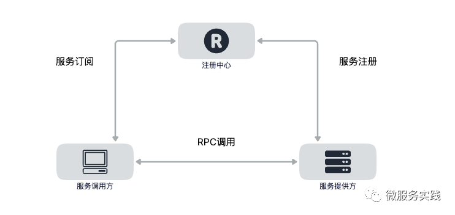

# Microservice

> **微服务架构（Microservices）**:微服务是一种通过多个小型服务组合来构建单个应用的架构风格，这些服务围绕业务能力而非特定的技术标准来构建。各个服务可以采用不同的编程语言，不同的数据存储技术，运行在不同的进程之中。服务采取轻量级的通信机制和自动化的部署机制实现通信与运维。

+ **围绕业务能力构建（Organized around Business Capability）**:如果本应该归属同一个产品内的功能被划分在不同团队中，必然会产生大量的跨团队沟通协作，跨越团队边界无论在管理、沟通、工作安排上都有更高昂的成本，高效的团队自然会针对其进行改进，当团队、产品磨合调节稳定之后，团队与产品就会拥有一致的结构。
+ **分散治理（Decentralized Governance）**: 服务对应的开发团队有直接对服务运行质量负责的责任，也应该有着不受外界干预地掌控服务各个方面的权力，譬如选择与其他服务异构的技术来实现自己的服务。微服务更加强调的是确实有必要技术异构时，应能够有选择“不统一”的权利，譬如不应该强迫 Node.js 去开发报表页面，要做人工智能训练模型时，应该可以选择 Python，等等。
+ **通过服务来实现独立自治的组件（Componentization via Services）**:之所以强调通过“服务”（Service）而不是“类库”（Library）来构建组件，是因为类库在编译期静态链接到程序中，通过本地调用来提供功能，而服务是进程外组件，通过远程调用来提供功能。前面的文章里我们已经分析过，尽管远程服务有更高昂的调用成本，但这是为组件带来隔离与自治能力的必要代价。
+ **产品化思维（Products not Projects）**:避免把软件研发视作要去完成某种功能，而是视作一种持续改进、提升的过程。譬如，不应该把运维只看作运维团队的事，把开发只看作开发团队的事，团队应该为软件产品的整个生命周期负责，开发者不仅应该知道软件如何开发，还应该知道它如何运作，用户如何反馈，乃至售后支持工作是怎样进行的。注意，这里服务的用户不一定是最终用户，也可能是消费这个服务的另外一个服务。以前在单体架构下，程序的规模决定了无法让全部人员都关注完整的产品，组织中会有开发、运维、支持等细致的分工的成员，各人只关注于自己的一块工作，但在微服务下，要求开发团队中每个人都具有产品化思维，关心整个产品的全部方面是具有可行性的。
+ **数据去中心化（Decentralized Data Management）**:微服务明确地提倡数据应该按领域分散管理、更新、维护、存储，在单体服务中，一个系统的各个功能模块通常会使用同一个数据库，诚然中心化的存储天生就更容易避免一致性问题，但是，同一个数据实体在不同服务的视角里，它的抽象形态往往也是不同的。譬如，Bookstore 应用中的书本，在销售领域中关注的是价格，在仓储领域中关注的库存数量，在商品展示领域中关注的是书籍的介绍信息，如果作为中心化的存储，所有领域都必须修改和映射到同一个实体之中，这便使得不同的服务很可能会互相产生影响而丧失掉独立性。尽管在分布式中要处理好一致性的问题也相当困难，很多时候都没法使用传统的事务处理来保证，但是两害相权取其轻，有一些必要的代价仍是值得付出的。
+ **强终端弱管道（Smart Endpoint and Dumb Pipe）**:微服务提倡类似于经典 UNIX 过滤器那样简单直接的通信方式，RESTful 风格的通信在微服务中会是更加合适的选择。
+ **容错性设计（Design for Failure）**:不再虚幻地追求服务永远稳定，而是接受服务总会出错的现实，要求在微服务的设计中，有自动的机制对其依赖的服务能够进行快速故障检测，在持续出错的时候进行隔离，在服务恢复的时候重新联通。所以“断路器”这类设施，对实际生产环境的微服务来说并不是可选的外围组件，而是一个必须的支撑点，如果没有容错性的设计，系统很容易就会被因为一两个服务的崩溃所带来的雪崩效应淹没。可靠系统完全可能由会出错的服务组成，这是微服务最大的价值所在。
+ **演进式设计（Evolutionary Design）**:容错性设计承认服务会出错，演进式设计则是承认服务会被报废淘汰。一个设计良好的服务，应该是能够报废的，而不是期望得到长存永生。假如系统中出现不可更改、无可替代的服务，这并不能说明这个服务是多么的优秀、多么的重要，反而是一种系统设计上脆弱的表现，微服务所追求的独立、自治，也是反对这种脆弱性的表现。
+ **基础设施自动化（Infrastructure Automation）**:基础设施自动化，如 CI/CD 的长足发展，显著减少了构建、发布、运维工作的复杂性。由于微服务下运维的对象比起单体架构要有数量级的增长，使用微服务的团队更加依赖于基础设施的自动化，人工是很难支撑成百上千乃至成千上万级别的服务的。

## rpc

## 服务发现
服务发现的目的是解耦程序对服务具体位置的依赖。在生产环境中服务提供方都是以集群的方式对外提供服务，集群中服务的IP随时都可能发生变化，比如服务重启，发布，扩缩容等，因此我们需要用一本“通讯录”及时获取到对应的服务节点，这个获取的过程其实就是“服务发现”。

+ **服务的注册（Service Registration）**:当服务启动的时候，应该通过某种形式（比如调用API、产生上线事件消息、在Etcd中记录、存数据库等等）把自己（服务）的信息通知给服务注册中心，这个过程一般是由微服务框架来完成，业务代码无感知。
+ **服务的维护（Service Maintaining）**:尽管在微服务框架中通常都提供下线机制，但并没有办法保证每次服务都能优雅下线（Graceful Shutdown），而不是由于宕机、断网等原因突然失联，所以，在微服务框架中就必须要尽可能的保证维护的服务列表的正确性，以避免访问不可用服务节点的尴尬。
+ **服务的发现（Service Discovery）**:这里所说的发现是狭义的，它特指消费者从微服务框架（服务发现模块）中，把一个服务标识（一般是服务名）转换为服务实际位置（一般是ip地址）的过程。这个过程（可能是调用API，监听Etcd，查询数据库等）业务代码无感知。

