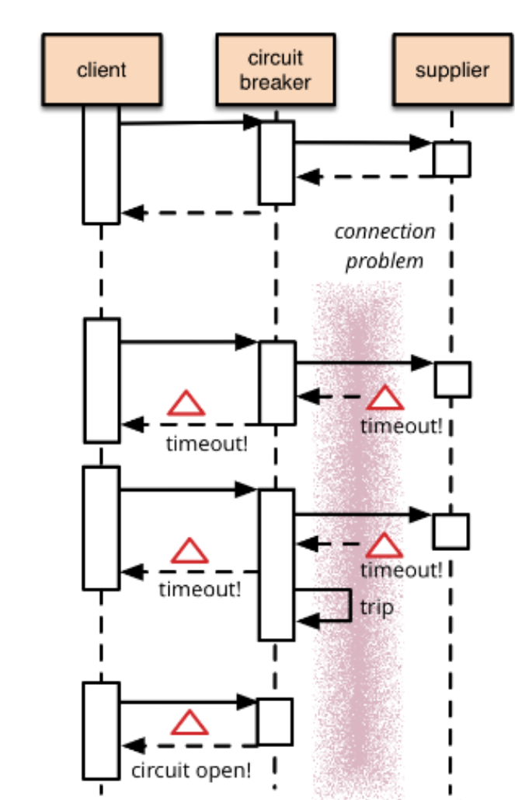
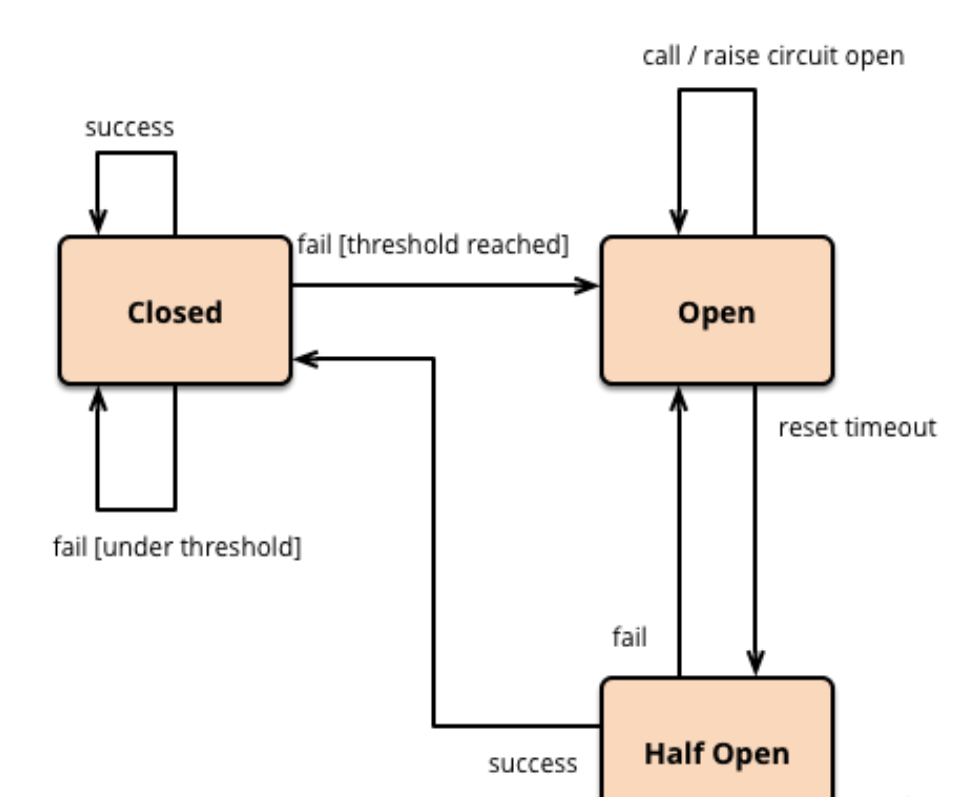
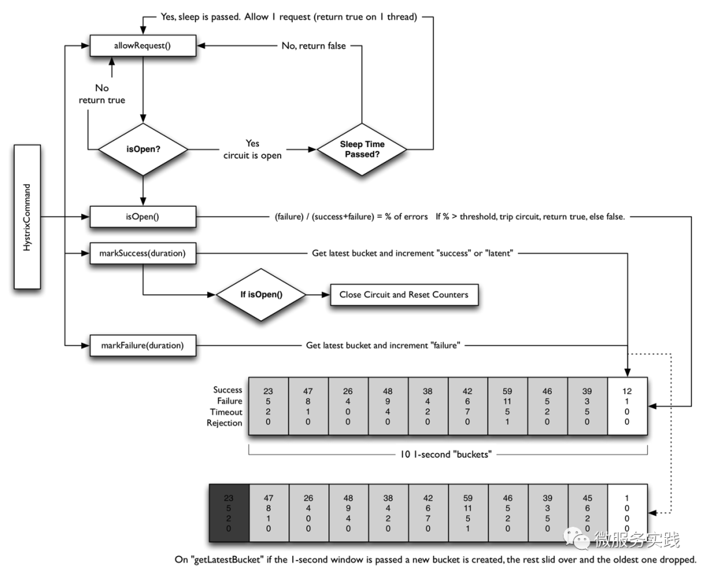
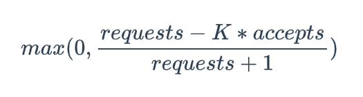

## 熔断
熔断机制（Circuit Breaker）指的是在股票市场的交易时间中，当价格的波动幅度达到某一个限定的目标（熔断点）时，对其暂停交易一段时间的机制。此机制如同保险丝在电流过大时候熔断，故而得名。熔断机制推出的目的是为了防范系统性风险，给市场更多的冷静时间，避免恐慌情绪蔓延导致整个市场波动，从而防止大规模股价下跌现象的发生。

熔断一般是在客户端（调用端）进行配置，当客户端向服务端发起请求的时候，服务端的错误不断地增多，这时候就可能会触发熔断，触发熔断后客户端的请求不再发往服务端，而是在客户端直接拒绝请求，从而可以保护服务端不会过载。这里说的服务端可能是rpc服务，http服务，也可能是mysql，redis等。注意熔断是一种有损的机制，当熔断后可能需要一些降级的策略进行配合。

### 原理
现代微服务架构基本都是分布式的，整个分布式系统是由非常多的微服务组成。不同服务之间相互调用，组成复杂的调用链路。在复杂的调用链路中的某一个服务如果不稳定，就可能会层层级联，最终可能导致整个链路全部挂掉。因此我们需要对不稳定的服务依赖进行熔断降级，暂时切断不稳定的服务调用，避免局部不稳定因素导致整个分布式系统的雪崩。



熔断器内部维护了一个熔断器状态机，状态机的转换关系如下图所示：


熔断器有三种状态：
+ **Closed状态**：也是初始状态，我们需要一个调用失败的计数器，如果调用失败，则使失败次数加1。如果最近失败次数超过了在给定时间内允许失败的阈值，则切换到Open状态，此时开启一个超时时钟，当到达超时时钟时间后，则切换到Half Open状态，该超时时间的设定是给了系统一次机会来修正导致调用失败的错误，以回到正常的工作状态。在Closed状态下，错误计数是基于时间的。在特定的时间间隔内会自动重置，这能够防止由于某次的偶然错误导致熔断器进入Open状态，也可以基于连续失败的次数。
+ **Open状态**：在该状态下，客户端请求会立即返回错误响应，而不调用服务端。
+ **Half-Open状态**：允许客户端一定数量的去调用服务端，如果这些请求对服务的调用成功，那么可以认为之前导致调用失败的错误已经修正，此时熔断器切换到Closed状态，同时将错误计数器重置。如果这一定数量的请求有调用失败的情况，则认为导致之前调用失败的的问题仍然存在，熔断器切回到断开状态，然后重置计时器来给系统一定的时间来修正错误。Half-Open状态能够有效防止正在恢复中的服务被突然而来的大量请求再次打挂。

### 示例
+ **hystrix-go**
  


1. 有请求来了，首先allowRequest()函数判断是否在熔断中，如果不是则放行，如果是的话，还要看有没有达到一个熔断时间片，如果熔断时间片到了，也放行，否则直接返回错误。
```go
// AllowRequest is checked before a command executes, ensuring that circuit state and metric health allow it.
// When the circuit is open, this call will occasionally return true to measure whether the external service
// has recovered.
func (circuit *CircuitBreaker) AllowRequest() bool {
	return !circuit.IsOpen() || circuit.allowSingleTest()
}
```

IsOpen先看当前是否已经打开了，如果已经打开了就直接返回就行了，如果还没打开就去判断
+ 请求数量是否满足要求
+ 请求的错误率是否过高，如果两个都满足就会打开熔断器

```go
// IsOpen is called before any Command execution to check whether or
// not it should be attempted. An "open" circuit means it is disabled.
func (circuit *CircuitBreaker) IsOpen() bool {
    circuit.mutex.RLock()
    o := circuit.forceOpen || circuit.open
    circuit.mutex.RUnlock()
    
    if o {
        return true
    }
    
    if uint64(circuit.metrics.Requests().Sum(time.Now())) < getSettings(circuit.Name).RequestVolumeThreshold {
        return false
    }
    
    if !circuit.metrics.IsHealthy(time.Now()) {
        // too many failures, open the circuit
        circuit.setOpen()
        return true
	}

    return false
}
```

allowSingleTest 方法的作用是允许在断路器打开时进行单次测试，以确定外部服务是否已恢复。具体来说，当断路器打开时，allowSingleTest 方法会检查自上次测试或断路器打开以来是否已经过了一段时间（由 SleepWindow 配置决定）。如果是，它会允许进行一次测试请求，并更新最后测试时间。

```go
func (circuit *CircuitBreaker) allowSingleTest() bool {
	circuit.mutex.RLock()
	defer circuit.mutex.RUnlock()

	now := time.Now().UnixNano()
	openedOrLastTestedTime := atomic.LoadInt64(&circuit.openedOrLastTestedTime)
	//如果断路器是打开的，并且当前时间已经超过了上次测试时间加上 SleepWindow 的时间，则允许进行单次测试。
	if circuit.open && now > openedOrLastTestedTime+getSettings(circuit.Name).SleepWindow.Nanoseconds() {
		//更新
		swapped := atomic.CompareAndSwapInt64(&circuit.openedOrLastTestedTime, openedOrLastTestedTime, now)
		//记录日志
		if swapped {
			log.Printf("hystrix-go: allowing single test to possibly close circuit %v", circuit.Name)
		}
		return swapped
	}

	return false
}
```

2. 每次调用都有两个函数makeSuccess(duration)和makeFailure(duration)来统计一下在一定的duration内有多少是成功还是失败的。
3. 判断是否熔断的条件isOpen()，是计算failure/(success+failure)当前的错误率，如果高于一个阈值，那么熔断器打开，否则关闭。
4. Hystrix会在内存中维护一个数据，其中记录着每一个周期的请求结果的统计，超过时长长度的元素会被删除掉。


+ **go-zero**
  go-zero中熔断没有采用与hystrix相同的机制，而是参考了《Google Sre》 采用了一种自适应的熔断机制。

**Google SRE 过载保护算法**



算法如上所示，这个公式计算的是请求被丢弃的概率
+ requests: 一段时间的请求数量
+ accepts: 成功的请求数量
+ K: 倍率，K 越小表示越激进，越小表示越容易被丢弃请求

这个算法的好处是不会直接一刀切的丢弃所有请求，而是计算出一个概率来进行判断，当成功的请求数量越少，K越小的时候
的值就越大，计算出的概率也就越大，表示这个请求被丢弃的概率越大

go-zero实现
```go
const (
    // 250ms for bucket duration
    window            = time.Second * 10
    buckets           = 40
    forcePassDuration = time.Second
    k                 = 1.5
    minK              = 1.1
    protection        = 5
)


// googleBreaker is a netflixBreaker pattern from google.
// see Client-Side Throttling section in https://landing.google.com/sre/sre-book/chapters/handling-overload/
func newGoogleBreaker() *googleBreaker {
	bucketDuration := time.Duration(int64(window) / int64(buckets))
	// 使用 collection.NewRollingWindow 创建一个滚动窗口 st，使用滑动窗口来记录请求总数和错误数。
	st := collection.NewRollingWindow[int64, *bucket](func() *bucket {
		return new(bucket)
	}, buckets, bucketDuration)
	return &googleBreaker{
		stat:     st,
		k:        k,
		proba:    mathx.NewProba(),
		lastPass: syncx.NewAtomicDuration(),
	}
}
```


```go
func (b *googleBreaker) accept() error {
	var w float64
	history := b.history()
	w = b.k - (b.k-minK)*float64(history.failingBuckets)/buckets
	weightedAccepts := mathx.AtLeast(w, minK) * float64(history.accepts)
	// https://landing.google.com/sre/sre-book/chapters/handling-overload/#eq2101
	// for better performance, no need to care about the negative ratio
	dropRatio := (float64(history.total-protection) - weightedAccepts) / float64(history.total+1)
	if dropRatio <= 0 {
		return nil
	}

	lastPass := b.lastPass.Load()
	if lastPass > 0 && timex.Since(lastPass) > forcePassDuration {
		b.lastPass.Set(timex.Now())
		return nil
	}

	dropRatio *= float64(buckets-history.workingBuckets) / buckets
    
	//使用概率计算，如果满足丢弃条件，则返回 ErrServiceUnavailable 错误
	if b.proba.TrueOnProba(dropRatio) {
		return ErrServiceUnavailable
	}

	b.lastPass.Set(timex.Now())

	return nil
}

```

+ **Kratos**
```go
func (b *sreBreaker) Allow() error {
	// 统计成功的请求，和总的请求
	success, total := b.summary()

	// 计算当前的成功率
	k := b.k * float64(success)
	if log.V(5) {
		log.Info("breaker: request: %d, succee: %d, fail: %d", total, success, total-success)
	}
	// 统计请求量和成功率
	// 如果 rps 比较小，不触发熔断
	// 如果成功率比较高，不触发熔断，如果 k = 2，那么就是成功率 >= 50% 的时候就不熔断
	if total < b.request || float64(total) < k {
		if atomic.LoadInt32(&b.state) == StateOpen {
			atomic.CompareAndSwapInt32(&b.state, StateOpen, StateClosed)
		}
		return nil
	}
	if atomic.LoadInt32(&b.state) == StateClosed {
		atomic.CompareAndSwapInt32(&b.state, StateClosed, StateOpen)
	}

	// 计算一个概率，当 dr 值越大，那么被丢弃的概率也就越大
	// dr 值是，如果失败率越高或者是 k 值越小，那么它越大
	dr := math.Max(0, (float64(total)-k)/float64(total+1))
	drop := b.trueOnProba(dr)
	if log.V(5) {
		log.Info("breaker: drop ratio: %f, drop: %t", dr, drop)
	}
	if drop {
		return ecode.ServiceUnavailable
	}
	return nil
}

// 通过随机来判断是否需要进行熔断
func (b *sreBreaker) trueOnProba(proba float64) (truth bool) {
	b.randLock.Lock()
	truth = b.r.Float64() < proba
	b.randLock.Unlock()
	return
}
```
