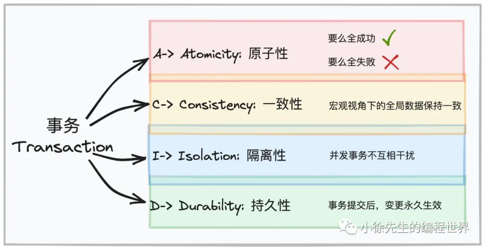
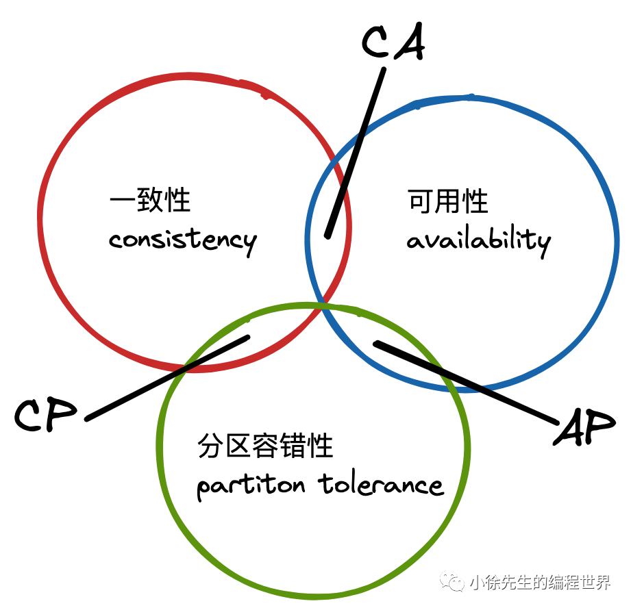

# 分布式事务

## 事务

+ Atomicity（原子性）：一个事务中的所有操作，要么全部完成，要么全部不完成，不会结束在中间某个环节。事务在执行过程中发生错误，会被恢复到事务开始前的状态，就像这个事务从来没有执行过一样。
+ Consistency（一致性）：在事务开始之前和事务结束以后，数据库的完整性没有被破坏。完整性包括外键约束、应用定义等约束不会被破坏。
+ Isolation（隔离性）：数据库允许多个并发事务同时对其数据进行读写和修改的能力，隔离性可以防止多个事务并发执行时由于交叉执行而导致数据的不一致。
+ Durability（持久性）：事务处理结束后，对数据的修改就是永久的，即便系统故障也不会丢失。

## CAP理论

1. C：Consistency，一致性.该项强调数据的正确性. 具体而言，每次读操作，要么读到最新，要么读失败. 这要求整个分布式系统像是一个不可拆分的整体，写操作作用于集群像作用于单机一样，具有广义的“原子性”.
2. A：Availability，可用性.该项站在使用者的角度，强调使用服务的体验.客户端的请求能够得到响应，不发生错误，也不能出现过长的等待时间.
3. P：Partition tolerance，分区容错性.分区容错性强调的是，在网络环境不可靠的背景下，整个系统仍然是正常运作的，不至于出现系统崩溃或者秩序混乱的局面.

CAP 理论强调的是，一个系统中，C、A、P 三项性质至多只能满足其二，即每个系统依据其架构设计会具有 CP、AP 或者 CA 的倾向性.

1. CP：强调系统数据的正确性，但由于建立保证不同节点间保证数据严格一致的机制，可能会牺牲系统的可用性.
2. AP：强调系统的可用性，那就必须在数据一致性上做出妥协退让.

## BASE理论
BASE是Basically Available（基本可用）、Soft state（软状态）和Eventually consistent（最终一致性）三个短语的简写，BASE是对CAP中一致性和可用性权衡的结果，其来源于对大规模互联网系统分布式实践的结论，是基于CAP定理逐步演化而来的，其核心思想是即使无法做到强一致性（Strong consistency），但每个应用都可以根据自身的业务特点，采用适当的方式来使系统达到最终一致性（Eventual consistency）。

+ 基本可用是指分布式系统在出现不可预知故障的时候，允许损失部分可用性——但请注意，这绝不等价于系统不可用。
+ 弱状态也称为软状态，和硬状态相对，是指允许系统中的数据存在中间状态，并认为该中间状态的存在不会影响系统的整体可用性，即允许系统在不同节点的数据副本之间进行数据同步的过程存在延时。
+ 最终一致性强调的是系统中所有的数据副本，在经过一段时间的同步后，最终能够达到一个一致的状态。因此，最终一致性的本质是需要系统保证最终数据能够达到一致，而不需要实时保证系统数据的强一致性。

## SAGA 事务
SAGA 事务模式的历史十分悠久，还早于分布式事务概念的提出。它源于 1987 年普林斯顿大学的 Hector Garcia-Molina 和 Kenneth Salem 在 ACM 发表的一篇论文《SAGAS》（这就是论文的全名）。文中提出了一种提升“长时间事务”（Long Lived Transaction）运作效率的方法，大致思路是把一个大事务分解为可以交错运行的一系列子事务集合。原本 SAGA 的目的是避免大事务长时间锁定数据库的资源，后来才发展成将一个分布式环境中的大事务分解为一系列本地事务的设计模式。SAGA 由两部分操作组成。

SAGA 由两部分操作组成。
+ 大事务拆分若干个小事务，将整个分布式事务 T 分解为 n 个子事务，命名为 T1，T2，…，Ti，…，Tn。每个子事务都应该是或者能被视为是原子行为。如果分布式事务能够正常提交，其对数据的影响（最终一致性）应与连续按顺序成功提交 Ti等价。
+ 为每一个子事务设计对应的补偿动作，命名为 C1，C2，…，Ci，…，Cn。Ti与 Ci必须满足以下条件：
    + Ti与 Ci都具备幂等性。
    + Ti与 Ci满足交换律（Commutative），即先执行 Ti还是先执行 Ci，其效果都是一样的。
    + Ci必须能成功提交，即不考虑 Ci本身提交失败被回滚的情形，如出现就必须持续重试直至成功，或者要人工介入。

如果 T1到 Tn均成功提交，那事务顺利完成，否则，要采取以下两种恢复策略之一：
+ **正向恢复（Forward Recovery）**：如果 Ti事务提交失败，则一直对 Ti进行重试，直至成功为止（最大努力交付）。这种恢复方式不需要补偿，适用于事务最终都要成功的场景，譬如在别人的银行账号中扣了款，就一定要给别人发货。正向恢复的执行模式为：T1，T2，…，Ti（失败），Ti（重试）…，Ti+1，…，Tn。
+ **反向恢复（Backward Recovery）**：如果 Ti事务提交失败，则一直执行 Ci对 Ti进行补偿，直至成功为止（最大努力交付）。这里要求 Ci必须（在持续重试后）执行成功。反向恢复的执行模式为：T1，T2，…，Ti（失败），Ci（补偿），…，C2，C1。

