# 1.什么是Docker  
## (1)容器技术的起源 
假设我们正在研发一个APP，程序员自己从头到尾搭建了一套环境，写完后把代码交给测试同学测试，   

测试同学从头到尾搭建这套环境，测试过程中出现问题程序员也不用担心，大可以一脸无辜的撒娇，“明明在人家的环境上可以运行的”。  

测试同学测完后终于可以上线了，这时运维同学又要重新从头到尾搭建这套环境，费了九牛二虎之力搭建好环境开始上线， 

糟糕，上线系统就崩溃了，这时心理素质好的程序员又可以施展演技了，“明明在人家的环境上可以运行的”。 

从整个过程可以看到，我们**重复搭建了三套环境**还要迫使程序员转行演员浪费表演才华，典型的浪费时间和效率,因此容器技术应运而生。    

在继续学习docker之前我们先看另一个问题，**我们有虚拟机啊，先搭好一套虚拟机环境然后给测试和运维clone出来**不就可以了吗？    
在没有容器技术之前，这确实是一个好办法，只不过这个办法还没有那么好。下面我们认识一下他们的不同  
## (2)虚拟化技术VS容器化技术 
和一个单纯的应用程序相比，操作系统是一个**笨重**的程序操作系统，运行起来占用很多资源，刚装好的系统还什么都没有部署，单纯的其磁盘占用至少几十G起步，内存要几个G起步。   
假设我有一台机器，16G内存，需要部署三个应用，那么使用虚拟机技术可以这样划分
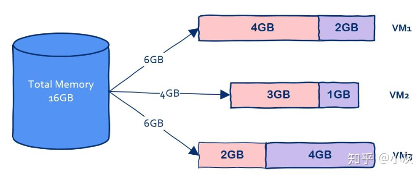  
在这台机器上开启三个虚拟机，其中VM1占用2G内存，VM2占用1G内存，VM3占用4G内存。每个虚拟机上又部署一个应用，  

我们可以看到虚拟机本身就占据了总共7G内存，可是我们部署的是应用程序，要用的也是应用程序而不是操作系统。  

**这是问题一，主要原因在于操作系统太重了。**

**还有另一个问题，就是启动时间问题**，操作系统重启是非常慢的，因为操作系统要从头到尾把该检测的都检测了该加载的都加载上，

那么有没有一种技术可以让我们获得虚拟机的好处又能克服这些缺点从而一举实现鱼和熊掌的兼得呢？

答案是肯定的，这就是容器技术。下面我们看什么是容器
## (3)什么是容器
容器一词的英文是container，container的意思还有集装箱，集装箱绝对是商业史上了不起的一项发明，大大降低了海洋贸易运输成本。让我们来看看集装箱的好处：

>集装箱之间相互隔离  
>长期反复使用  
>快速装载和卸载  
>规格标准，在港口和船上都可以摆放

回到软件中的容器，其实容器和集装箱在概念上是很相似的。

现代软件开发的一大目的就是隔离，应用程序在运行时相互独立互不干扰，这种隔离实现起来是很不容易的，  
其中一种解决方案就是上面提到的虚拟机技术，通过将应用程序部署在不同的虚拟机中从而实现隔离。如下图  
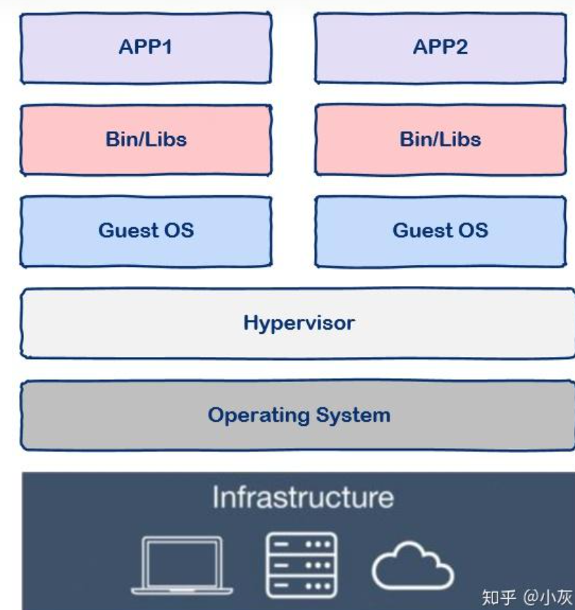  
与虚拟机通过操作系统实现隔离不同，容器技术**只隔离应用程序的运行时环境，而共享同一个操作系统**，如下图（这里的运行时环境指的是程序运行依赖的各种库以及配置。）  
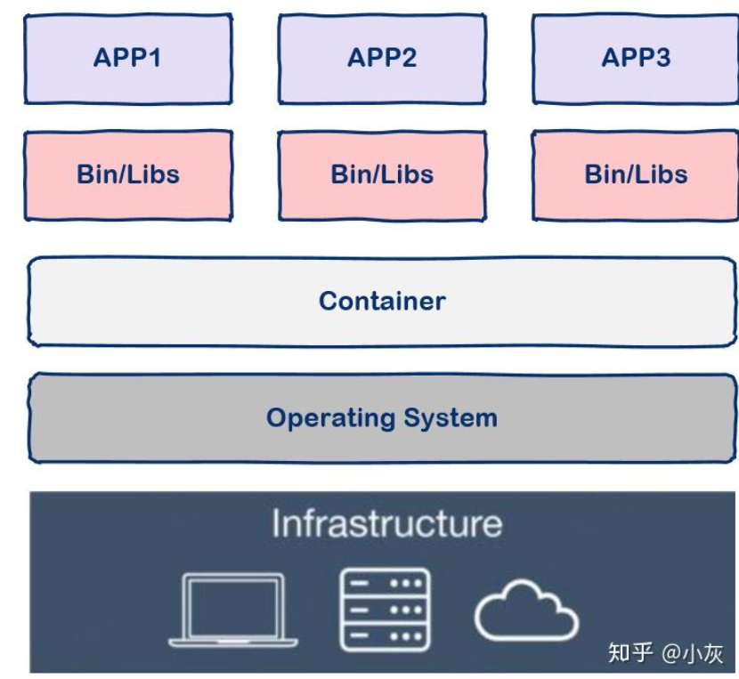  
与操作系统动辄几G的内存占用相比，容器技术只需数M空间，因此我们可以在同样规格的硬件上大量部署容器，这是虚拟机所不能比拟的，而且不同于操作系统，容器几乎瞬时启动，容器技术为打包服务栈提供了一种更加高效的方式，So cool。

那么我们该怎么使用容器呢？这就要讲到docker了。

容器是一种通用技术，docker就是其中的一种实现。
## (4) 什么是docker
docker是一个用Go语言实现的开源项目，可以让我们方便的创建和使用容器，docker将程序以及程序所有的依赖都打包到docker container，这样你的程序可以在任何环境都会有一致的表现，

这里程序运行的依赖也就是容器就好比集装箱，容器所处的操作系统环境就好比货船或港口，程序的表现只和集装箱（容器）有关系，和集装箱放在哪个货船或者哪个港口(操作系统)没有关系。

因此我们可以看到docker可以屏蔽环境差异，也就是说，只要你的程序打包到了docker中，那么无论运行在什么环境下程序的行为都是一致的，程序员再也无法施展表演才华了，不会再有“在我的环境上可以运行”，真正实现“build once, run everywhere”。

此外docker的另一个好处就是快速部署，这是当前互联网公司最常见的一个应用场景，一个原因在于容器启动速度非常快，另一个原因在于只要确保一个容器中的程序正确运行，那么你就能确信无论在生产环境部署多少都能正确运行。

## (5)先看我们提到docker最可能先想到的两个名词

 ### ②image(镜像)

是容器的静态模板，包含了应用程序运行所需的所有依赖和文件。镜像是不可变的

### ③Container（容器）

镜像的一个运行实例，具有自己的文件系统、进程、网络等，且是动态的。容器从镜像启动，并在运行时保持可变。

总结：我们使用docker的一个最终目的就是将应用和环境打包成一个镜像，交给测试和运维
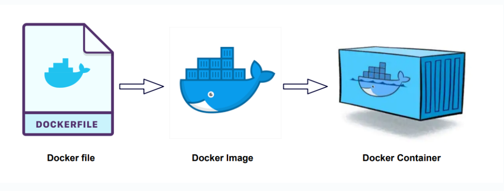

# 2.安装  

##  前置
docker需要在Linux环境下运行，配置Linux有多种方式，  
比如使用win10和win11自带的wsl（这个方法比较方便，但是安装的wsl会自动下载到c盘，想要导出到其他盘好像有些麻烦），或者使用虚拟机（如vmware和hyper-v）在电脑上安装一个Linux系统，或者购置Linux云服务器，我使用的是vmware+ubuntu版Linux  
(1)卸载之前安装的docker
```
sudo apt-get remove docker docker-engine docker.io containerd runc
```
(2) 安装环境
```
sudo apt install apt-transport-https ca-certificates curl software-properties-common gnupg lsb-release

# 阿里源(gpg KEY)
curl -fsSL https://mirrors.aliyun.com/docker-ce/linux/ubuntu/gpg | sudo gpg --dearmor -o /usr/share/keyrings/docker-archive-keyring.gpg

# 阿里的apt源
echo "deb [arch=$(dpkg --print-architecture) signed-by=/usr/share/keyrings/docker-archive-keyring.gpg] https://mirrors.aliyun.com/docker-ce/linux/ubuntu $(lsb_release -cs) stable" | sudo tee /etc/apt/sources.list.d/docker.list > /dev/null

# 更新apt
sudo apt update

sudo apt-get update
```
(3)安装docker
```
#安装最新版本的Docker
sudo apt install docker-ce docker-ce-cli containerd.io
```
(4)查看安装版本
```
sudo docker version
```
(5)查看运行状态
```
sudo systemctl status docker
```
查看完后按q可返回控制台  
(6)安装docker命令补全工具(可选操作)(未完成，网址无法访问且未找到对的镜像源)
```
sudo apt-get install bash-completion

sudo curl -L https://raw.githubusercontent.com/docker/docker-ce/master/components/cli/contrib/completion/bash/docker -o /etc/bash_completion.d/docker.sh

source /etc/bash_completion.d/docker.sh

```
(7)配置可用的docker镜像源
```
//打开或创建 /etc/docker/daemon.json 文件
sudo nano /etc/docker/daemon.json 

//添加以下内容
{
    "registry-mirrors": [
        "https://docker.1ms.run",
        "https://dockerpull.com",
        "https://docker.anyhub.us.kg",
        "https://dockerhub.jobcher.com",
        "https://dockerhub.icu",
        "https://docker.awsl9527.cn",
        "https://docker.m.daocloud.io"
    ]
}

//添加完后使用ctrl+O(这是英文字母O）保存，再ctrl+x退出namo编辑器返回控制台


//重新加载daemon文件
systemctl daemon-reload

//重启docker
systemctl restart docker

```
(8)查看镜像源是否配置成功
```
//输入以下，可以在 Registry Mirrors 一栏中看到你配置的镜像源
docker info 
```
# 3.简单的使用
## (docker的全部应用还是较多的，所以我只从一个小实战里拆分出命令放到这里，  
## 下面一部分是几个具体的命令，另一部分是应用这些命令进行了一个小实战)

##  (1)镜像使用
  ①列出所有镜像
>docker images

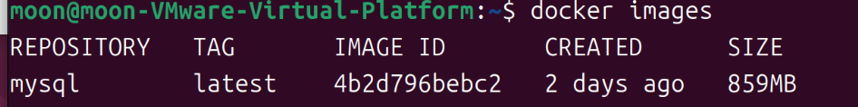
>REPOSITORY：表示镜像的仓库源  
>TAG：镜像的标签  
>IMAGE ID：镜像ID  
>CREATED：镜像创建时间  
>SIZE：镜像大小  

 ②获取新镜像

  >docker pull 镜像名:tag(如果不加tag的话默认拉取最新版本（latest）的镜像)
```
 docker pull ubuntu:13.10
 docker pull mysql
 ```
③删除镜像 docker rmi

使用镜像名或者镜像id都可以删除，删除后我们可以在通过docker images查看是否删除成功
```
 docker rmi mysql
 docker rmi 4b2d796bebc2
```
##  (2)容器使用
  ①启动容器：
  >docker run  
  > -d:后台运行容器  
  > -it:使用交互式终端（命令行模式进入这个容器）  
  > exit：退出我们用-it进入的终端    
  > -p:进行端口映射  
  > -v：进行数据卷挂载
  
  ②查看所有的容器:
  >docker ps -a
  >如果只看运行中的：docker ps
  
  ③删除容器：
  >  docker rm 1e560fca3906  
  >docker rm -f 1e560fca3906(通常我们只能移除停止运行的容器，加入-f可以直接强制移除运行中的容器)  
>  docker container prune（删除所有停止运行的容器）
## (3)容器数据卷
   什么是容器数据卷?
 
   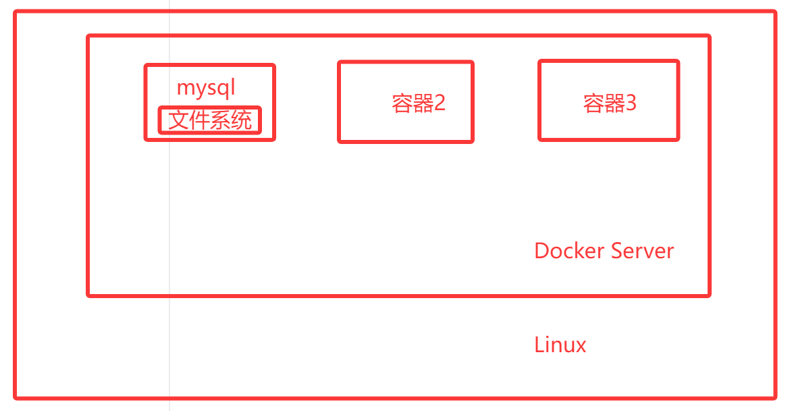

   设想一个场景，我们docker pull了一个mysql镜像，并用它docker run了一个容器，后续我们添加修改的所有数据都在容器中，如果容器删除，数据就会丢失! 无法达到持久化的目的
   
   需求:数据要持久化，把容器内的数据同步到本地

  这里就可以引入我们的数据卷挂载，将容器内的目录和容器外linux系统的目录映射，两者数据同步，如下图  

  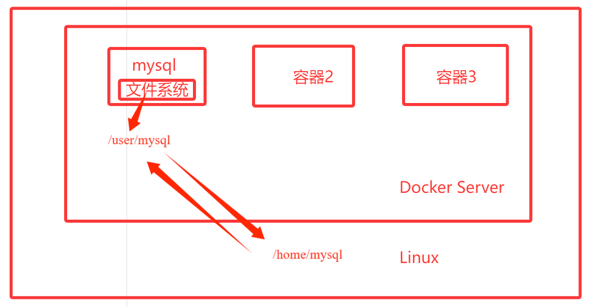

  ### 使用
 ```
 //方式一:使用命令 -v
 docker run -it -v 主机目录: 容器内目录
 ```

注：挂载是双向的，在mysql中修改会同步到linux的对应目录中，反之也会同步
# 4.简单实战：MySQL
①获取镜像
>docker pull mysql

②查看我们获取的镜像

> docker images


③启动一个MySQL容器(不同的镜像启动时需要的配置一般不同，我们可以去docker hub上搜索对应的镜像查看帮助文档)

我们在docker hub上搜索MySQL，找到它的帮助文档中如何启动的部分，如下  
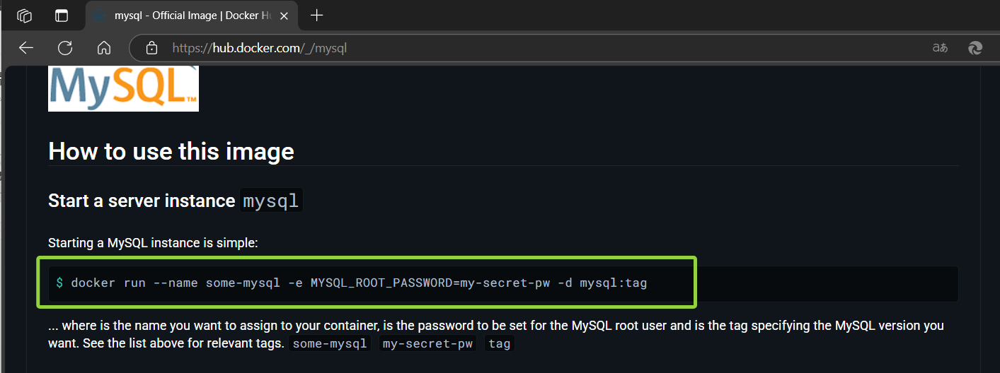

>$ docker run --name some-mysql -e MYSQL_ROOT_PASSWORD=my-secret-pw -d mysql:tag

参照上述和容器启动使用的部分的命令，给出如下

> docker run -d -p 3310:3306 -v /home/mysql/conf:/etc/mysql/conf.d -v/home/mysql/data:/var/lib/mysql -e MYSQL_R0OT_PASSWORD=123456 --name mysql01 mysql:latest

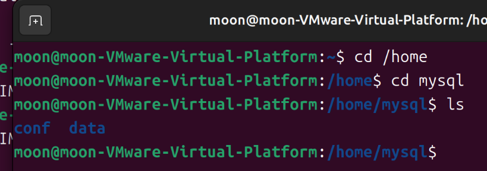

④使用docker ps查看我们刚刚启动的容器  
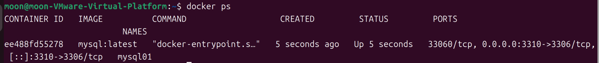

⑤查看虚拟机的IP地址 hostname -I(第二个是本地回环地址，不能被外网访问，所以后续我们用第一个)  
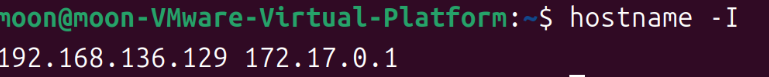

⑥从我们的本机访问这个MySQL服务，并进行操作  
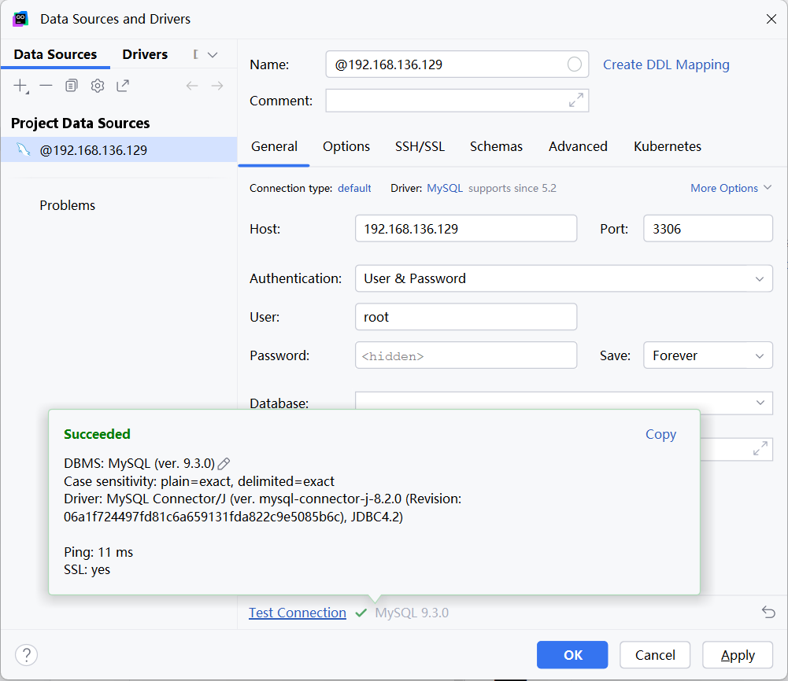


参考文档：1.什么是Docker？看这一篇干货文章就够了！：https://zhuanlan.zhihu.com/p/187505981  
        2.菜鸟教程docker：https://www.runoob.com/docker/docker-tutorial.html  
        3.刘硕学长的博客：http://8.130.119.166/archives/1704210856998
