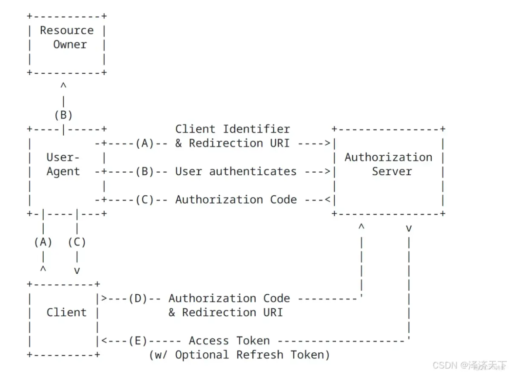

# 基于SpringSecurity6的Oauth2.0服务端配置

## 1.SpringSecurity简单介绍

SpringSecurity是一个能够为基于Spring的企业应用系统提供声明式的安全访问控制解决方案的安全
框架。由于它是Spring生态系统中的一员，因此它伴随着整个Spring生态系统不断修正、升级，在
springboot项目中加入springsecurity更是十分简单，使用SpringSecurity减少了为企业系统安全控
制编写大量重复代码的工作。

## 项目依赖

```java
<dependency>
<groupId>org.springframework.boot</groupId>
<artifactId>spring-boot-starter-security</artifactId>
</dependency>
```
## 工作原理

SpringSecurity所解决的问题就是安全访问控制，而安全访问控制功能其实就是对所有进入系统的请
求进行拦截，校验每个请求是否能够访问它所期望的资源。SpringSecurity对Web资源的保护是靠
Filter实现的。当初始化SpringSecurity时，会创建一个名为SpringSecurityFilterChai的S ervlet过
滤器，类型为org.springframework.security.web.FilterChainProxy，它实现了javax.servlet.Filter，
因此外部的请求会经过此类，下图是SpringSecurity过虑器链结构图：


springSecurity功能的实现主要是由一系列过滤器链相互配合完成。

### 认证功能

1.DaoAuthenticationProvider中包含了一个UserDetailsService实例，它负责根据用戶名提取用戶信
息UserDetails(包含密码)，而后DaoAuthenticationProvider会去对比UserDetailsService提取的用戶
密码与用戶提交的密码是否匹配作为认证成功的关键依据。

```java
public interface UserDetails extends Serializable {  
    Collection getAuthorities();  
    String getPassword();  
    String getUsername();  
    boolean isAccountNonExpired();  
    boolean isAccountNonLocked();  
    boolean isCredentialsNonExpired();  
    boolean isEnabled()
  }
```

2.认识PasswordEncoder:DaoAuthenticationProvider认证处理器通过UserDetailsService获取到
UserDetails后，它是如何与请求Authentication中的密码做对比呢？

    在这里SpringSecurity为了适应多种多样的加密类型，又做了抽象，
DaoAuthenticationProvider通过PasswordEncoder接口的matches方法进行密码的对比,而Spring
Security提供很多内置的PasswordEncoder，使用某种PasswordEncoder只需要进行如下声明即可:

```java
@Bean public PasswordEncoder passwordEncoder() {
return NoOpPasswordEncoder.getInstance();
}
```
密码比较流程如下：

1、用戶输入密码（明文）

2 、DaoAuthenticationProvider获取UserDetails（其中存储了用戶的正确密码）

3 、DaoAuthenticationProvider使用PasswordEncoder对输入的密码和正确的密码进行校验，密码一
致则校验通过，否则校验失败

***本次demo展示采用用BCryptPasswordEncoder***

### 授权功能

#### web授权

SpringSecurity可以通过`http.authorizeRequests()`对web请求进行授权保护。SpringSecurity使用
标准Filter建立了对web请求的拦截，最终实现对资源的授权访问。

```java
http
.authorizeRequests()
.antMatchers("/r/r1").hasAuthority("p1")
.antMatchers("/r/r2").hasAuthority("p2") ...
```


#### 方法授权

从SpringSecurity2.0版本开始，支持服务层方法的安全性的支持。
`@PreAuthorize`,`@PostAuthorize`,`@Secured`三类注解。我们可以在任何`@Configuration`实例上使
用`@EnableMethodSecurity()`注释来启用基于注解的安全性。

```java
@RestController
@RequestMapping
public class RecourseController {

@GetMapping("/r") //任何权限均可访问
public String r(){
return "访问资源";
}

@GetMapping(value = "/r1")
@PreAuthorize("hasAuthority('SCOPE_all')") //只有scope授权范围为all才可以访
问
public String r1(){
return "访问资源1";
}
```
**1.@Secured** 

**特点** ：

- **Spring专属** ：最早的SpringSecurity授权注解
- **简单⻆色检查** ：仅支持基于⻆色的简单验证
- **执行时机** ：方法调用前验证

**2.@PreAuthorize** 

**特点** ：

- **灵活条件** ：可访问方法参数和Spring上下文
- **执行时机** ：方法调用前验证
- **需启用** ：需要启动`@EnableMethodSecurity()`

**3.@PostAuthorize** 

**特点** ：

- **返回值访问** ：可以引用方法返回值进行验证
- **执行时机** ：方法执行后验证（适合返回值过滤）
- **需启用** ：同@PreAuthorize

## 2.Oauth2

### 简单介绍

OAuth（开放授权）是一个开放标准，允许用戶授权第三方应用访问他们存储在另外的服务提供者上
的信息，而不需要将用戶名和密码提供给第三方应用或分享他们数据的所有内容。OAuth2.0是O Auth
协议的延续版本，但不向后兼容OAuth1.0即完全废止了OAuth1.0。

**OAuth2.0有客戶端模式（client_credentials）、密码模式（password）、**
**简化模式（implicit）、授权码模式（authorization_code）、token刷新模式（refresh_token）**

#### 项目依赖

```Java
<dependency>
<groupId>org.springframework.boot</groupId>
<artifactId>spring-boot-starter-oauth2-authorization-server</artifactId>
</dependency> //授权服务器依赖
<dependency>
<groupId>org.springframework.boot</groupId>
<artifactId>spring-boot-starter-oauth2-resource-server</artifactId>
</dependency> //资源服务器依赖
```
#### Oauth2.0⻆色介绍：

1 、客戶端 **(client）** 本身不存储资源，需要通过资源拥有者的授权去请求资源服务器的资源，比如：
Android客戶端、Web客戶端（浏览器端）、微信客戶端等。

2 、资源拥有者 **(ResourceOwner)** 通常为用戶，也可以是应用程序，即该资源的拥有者。

3 、授权服务器 **(AuthorizationServer）** （也称认证服务器）用于服务提供商对资源拥有的身份进行
认证、对访问资源进行授权，认证成功后会给客戶端发放令牌（access_token），作为客戶端访问资
源服务器的凭据。本例为微信的认证服务器。

4 、资源服务器 **(ResourceServer)** 存储资源的服务器。

现在还有一个问题，服务提供商能允许随便一个客戶端就接入到它的授权服务器吗？
答案是否定的，服务提供商会给准入的接入方一个身份，用于接入时的凭据:

- client_id：客戶端标识
- client_secret：客戶端秘钥

因此，准确来说，授权服务器对两种OAuth2.0中的两个⻆色进行认证授权，分别是资源拥有者、客戶
端

#### 常用模式说明

##### 1.授权码模式

OAuth2一种最常⻅的授权模式是授权码模式，时序图如下：


授权码模式是OAuth2.0协议中安全级别最高的一种认证模式，与密码模式类似，都需要使用到用戶
的账号信息在认证平台的登录操作，但有所不同的是，密码模式是要求用戶直接将自己在认证平台的
账号、密码提供给第三方应用（客戶端），由第三方平台进行代理用戶在认证平台的登录操作；而授
权码模式则是用戶在认证平台提供的界面进行登录，然后通过用戶确认授权后才将一次性授权码提供
给第三方应用，第三方应用拿到一次性授权码以后才去认证平台获取token。

对与授权码模式的工作详细流程，学⻓在之前的技术分享写的十分详细，这里不再赘述，可以参考这
个链接：
>https://github.com/Werun-backend/resource/blob/main/%E6%8A%80%E6%9C%AF%E5%88%86%E4%BA%AB/2024%E%B9%B4%E6%98%A5%E5%AD%A3/%E5%BC%A0%E6%B2%A3%E7%9D%BF/OAuth2.md

##### 2.RefreshToken模式

RefreshToken模式是对access_token过期的一种补办操作，换句话说可以叫做自动续期。它在给客戶
端办法access_token的时候也会同时发放refresh_token，而refresh_token的有效期要远大于
access_token的有效期，当客戶端发现access_token过期时，客戶端可以带着refresh_token向认证
服务器请求一个新的access_token,从而避免了用戶的再次登录。当然如果refresh_token也过期的话
是需要用戶重新进行登录的。

**Oauth2.1中去掉了密码模式、简化模式，增加了设备授权码模式，同时也对授权码模式增加了PKCE扩展。**

### 配置内容

#### 环境介绍

Spring-Security-OAuth2是对OAuth2的一种实现，跟前面介绍的SpringSecurity相辅相成，与
SpringCloud体系的集成也非常便利（集成springcloud这里就不再展示）。 OAuth2.0的服务提供方
涵盖两个服务，即授权服务(AuthorizationServer，也叫认证服务)和资源服务 (ResourceServer)，
使用SpringSecurityOAuth2的时候你可以选择把它们在同一个应用程序中实现，也可以选择建立使
用同一个授权服务的多个资源服务。授权服务(AuthorizationServer）应包含对接入端以及登入用戶
的合法性进行验证并颁发token等功能，对令牌的请求端点由SpringMVC控制器进行实现，下面是配
置一个认证服务必须要实现的endpoints：

- AuthorizationEndpoint服务于认证请求。默认URL：`/oauth2/authorize`
- TokenEndpoint服务于访问令牌的请求。默认URL：`/oauth2/token`

资源服务(ResourceServer)，应包含对资源的保护功能，对非法请求进行拦截，对请求中token进行
解析鉴权等，过滤器用于实现OAuth2.0资源服务,用来对请求给出的身份令牌解析鉴权

##### 技术更迭：

1. Spring Security OAuth 2.x 的终止维护
  - 2019年11月：Spring 团队宣布 停止维护 Spring Security OAuth 2.x，原因是代码库复杂且难以维护。
  - 2021年5月：Spring Security OAuth 2.x 正式进入 EOL（End-of-Life），不再提供官方支持。
2. 替代方案发布
  - 2020年：Spring 推出 Spring Authorization Server（全新实现的 OAuth 2.1/OpenID Connect 1.0 授权服务器）。
  - 2022年11月：Spring Authorization Server 1.0.0 GA 版本发布，标志着生产可用的替代方案成熟。
  - `AuthorizationServerConfigurerAdapter` 及其相关类（如 `@EnableAuthorizationServer`）从 Spring Security OAuth 2.3.0 开始标记为 `@Deprecated`，最终在 Spring Security 6.x 中完全移除。
本次技术分享采用spring security6 ，Spring Authorization Server，springboot3.4.x，mybatis等框架，JDK17

#### 代码实现
网上的Spring Authorization Server的教程少之又少，基本上都是针对Spring Security OAuth 2.x的讲解，但是代码结构变化比较大


我自己写了一个简单demo，配置了资源服务器和授权服务器，代码主要参考s pring官网介绍的配置。
这里只实现了基本的功能，spring对于两个服务端提供了大量自定义配置，细节可以参考官方介绍：

>https://docs.spring.io/spring-authorization-server/reference/getting-started.html

##### 授权服务器配置

###### 项目关键依赖

```java
<parent>
<groupId>org.springframework.boot</groupId>
<artifactId>spring-boot-starter-parent</artifactId>
<version>3.4.4</version>
<relativePath/> <!-- lookup parent from repository -->
</parent>
<dependencies>
<dependency>
<groupId>org.springframework.boot</groupId>
<artifactId>spring-boot-starter-web</artifactId>
</dependency>
<dependency>
<groupId>org.mybatis.spring.boot</groupId>
<artifactId>mybatis-spring-boot-starter</artifactId>
<version>3.0.4</version>
</dependency>
<dependency>
<groupId>com.mysql</groupId>
<artifactId>mysql-connector-j</artifactId>
<scope>runtime</scope>
</dependency>
<dependency>
<groupId>org.springframework.boot</groupId>
<artifactId>spring-boot-starter-test</artifactId>
<scope>test</scope>
</dependency>
<dependency>
<groupId>org.mybatis.spring.boot</groupId>
<artifactId>mybatis-spring-boot-starter-test</artifactId>
<version>3.0.4</version>
<scope>test</scope>
</dependency>
<dependency>
<groupId>org.springframework.boot</groupId>
<artifactId>spring-boot-starter-security</artifactId>
</dependency>
<dependency>
<groupId>org.projectlombok</groupId>
<artifactId>lombok</artifactId>
<scope>provided</scope>
</dependency>
<dependency>
<groupId>org.springframework.boot</groupId>
<artifactId>spring-boot-starter-thymeleaf</artifactId>
</dependency>
<dependency>
<groupId>org.springframework.boot</groupId>
<artifactId>spring-boot-starter-oauth2-authorization-server</artifactId>
</dependency>
</dependencies>
```
###### 关键配置类

```java
@Configuration
@EnableWebSecurity
@EnableMethodSecurity()
@RequiredArgsConstructor(onConstructor_ = {@Autowired})
public class SecurityConfig {
    private final UserDetailsService userDetailsService;

    @Bean
    @Order(2)
    public SecurityFilterChain securityFilterChain(HttpSecurity http) throws Exception {
        http
                .authorizeHttpRequests(authorize -> authorize
                        .requestMatchers
                                (       //"/login.html",//自定义登陆页面务必放行静态资源
                                        "/error",
                                        "/loginSuccess",
                                        "/css/**",
                                        "/js/**"
                                ).permitAll() // 允许公开访问的路径
                        .anyRequest().authenticated() // 其他所有请求都需要认证
                )
                .formLogin(form -> form
 //                       .loginPage("/login.html")
   //                     .loginProcessingUrl("/myLogin")
                        .defaultSuccessUrl("/loginSuccess")//方法权限认证关闭强制跳转
                )
                .logout(LogoutConfigurer::permitAll)
                .csrf(AbstractHttpConfigurer::disable)
                .userDetailsService(userDetailsService);

        return http.build();
    }
    @Bean
    public PasswordEncoder passwordEncoder() {
        return new BCryptPasswordEncoder();
    }


}
```
```java
@Configuration
public class AuthorizationServerConfig {
    @Bean
    @Order(1)
    public SecurityFilterChain authorizationServerSecurityFilterChain(HttpSecurity http) throws Exception {
        OAuth2AuthorizationServerConfigurer configurer =
                new OAuth2AuthorizationServerConfigurer();

        http
                .securityMatcher(configurer.getEndpointsMatcher())
                .authorizeHttpRequests(authz -> authz
                        .requestMatchers(
                                "/oauth2/jwks",        // 对应 tokenKeyAccess
                                "/oauth2/introspect"   // 对应 checkTokenAccess
                        ).permitAll()
                        .anyRequest().authenticated()
                )
                .with(configurer, Customizer.withDefaults());

        return http.build();
    }

    @Bean
    public RegisteredClientRepository registeredClientRepository() {
        RegisteredClient oidcClient = RegisteredClient.withId(UUID.randomUUID().toString())
                .clientId("client")
                .clientSecret("$2a$10$kU67yLzDFpC6Wc5Gnv/ZKeppt3wQjWuMVlyf6xz5sg/nGzR9B6IR2")       //必须要进行加密
                .clientAuthenticationMethod(ClientAuthenticationMethod.CLIENT_SECRET_POST)
                .authorizationGrantType(AuthorizationGrantType.AUTHORIZATION_CODE)
                .authorizationGrantType(AuthorizationGrantType.REFRESH_TOKEN)
                .redirectUri("https://www.baidu.com")
                .postLogoutRedirectUri("http://127.0.0.1:8080/")
                .scope("all")                                                             //申请授权码时必须要填写授权范围
                .clientSettings(ClientSettings.builder().requireAuthorizationConsent(true).build())
                .build();
        return new InMemoryRegisteredClientRepository(oidcClient);
    }


    @Bean
    public JWKSource<SecurityContext> jwkSource() {
        KeyPair keyPair = generateRsaKey();
        RSAPublicKey publicKey = (RSAPublicKey) keyPair.getPublic();
        RSAPrivateKey privateKey = (RSAPrivateKey) keyPair.getPrivate();
        RSAKey rsaKey = new RSAKey.Builder(publicKey)
                .privateKey(privateKey)
                .keyID(UUID.randomUUID().toString())
                .build();
        JWKSet jwkSet = new JWKSet(rsaKey);
        return new ImmutableJWKSet<>(jwkSet);
    }

    private static KeyPair generateRsaKey() {
        KeyPair keyPair;
        try {
            KeyPairGenerator keyPairGenerator = KeyPairGenerator.getInstance("RSA");
            keyPairGenerator.initialize(2048);
            keyPair = keyPairGenerator.generateKeyPair();
        }
        catch (Exception ex) {
            throw new IllegalStateException(ex);
        }
        return keyPair;
    }


    @Bean
    public JwtDecoder jwtDecoder(JWKSource<SecurityContext> jwkSource) {
        return OAuth2AuthorizationServerConfiguration.jwtDecoder(jwkSource);
    }

    @Bean
    public AuthorizationServerSettings authorizationServerSettings() {
        return AuthorizationServerSettings.builder().build();
    }
}
```
##### 代码解释
客户端详情（Client Details）能够在应用程序运行的时候进行更新，可以通过访问底层的存储服务（例如将客户 端详情存储在一个关系数据库的表中，就可以使用 （`JdbcClientDetailsService`）或者通过自己实现接口来进行管理。 我们暂时使用内存方式存储客户端详情信息：
`return new InMemoryRegisteredClientRepository(oidcClient);`
`clientAuthenticationMethod` 是 OAuth2 中用于定义 客户端如何向授权服务器认证自己身份 的关键配置。它的作用相当于告诉系统："客户端应该用什么方式证明自己是合法的"。

`JWKSource<SecurityContext> jwkSource()`
**作用**：配置 JWK (JSON Web Key) 源，用于提供加密密钥（这里是 RSA 密钥对），用于签名和验证 JWT 令牌。
**关键点**：
- 生成 RSA 密钥对（公钥+私钥）
- 将密钥对包装为 RSAKey 对象（JWK 的一种实现）
- 创建 JWKSet（一组 JWK，当前只有一对密钥）
- 返回不可变的 JWKSource 供授权服务器使用
`generateRsaKey()`
**作用**：生成 2048 位的 RSA 密钥对（公钥+私钥）。
**关键点**：
- 使用 Java 加密体系（JCA）的 `KeyPairGenerator`
- 密钥长度 2048 位（安全标准）
- 公钥用于验证令牌，私钥用于签名令牌
`JwtDecoder jwtDecoder()`
**作用**：配置 JWT 解码器，资源服务器用它来验证和解析 JWT 令牌。
**关键点**：
- 从 JWKSource 获取公钥来验证令牌签名
- 使用 `OAuth2AuthorizationServerConfiguration.jwtDecoder()` 快捷方式创建
- 确保资源服务器和授权服务器使用相同的密钥体系
`AuthorizationServerSettings authorizationServerSettings()`
**作用**：配置授权服务器的基本设置（默认使用空配置）
其他细节
- 第一个过滤器链（Order=1）：专门处理 /oauth2/authorize, /oauth2/token 等 OAuth2 端点
- 第二个过滤器链（Order=2）：处理所有其他请求（静态资源、登录页等）
- 第一个链通过 `securityMatcher()` 自动识别 OAuth2 端点
- 第二个链的 `permitAll()` 路径不会干扰 OAuth2 端点
- OAuth2 端点的未认证请求会重定向到 /login（由第一个链配置）
- 登录表单处理由第二个链配置
- 仅在常规 Web 链禁用（OAuth2 端点通常需要 CSRF 保护）
```java
//查询用戶信息方法
@Service
@RequiredArgsConstructor(onConstructor_ = {@Autowired})
public class UserServiceImpl implements UserService , UserDetailsService {
    private final UserMapper userMapper;


    @Override
    public UserDetails loadUserByUsername(String username) throws UsernameNotFoundException {
        User user = userMapper.selectUserInfo(username);
        if(user==null){
            throw new UsernameNotFoundException("用户不存在");
        }
        return org.springframework.security.core.userdetails.User.builder()
                .username(user.getUserName())
                .password(user.getPassword())
                .authorities(user.getAuthorities())
                .build();
    }
}
```

```java
//自定义用户实体
@Data
public class User {
    private int id;
    private String userName;
    private String password;
    private String authorities;

}
```

```java
//自定义登录界面（可选）
<!DOCTYPE html>
<html xmlns:th="http://www.thymeleaf.org"> <!-- 添加Thymeleaf命名空间 -->
<head>
    <meta http-equiv="Content-Type" content="text/html; charset=UTF-8"/>
    <meta charset="UTF-8">
    <title>登录</title>
</head>
<body>
<form action="/login" method="post"> <!-- 提交到Spring Security的登录端点 -->
    <div>
        <label>用户名:</label>
        <input type="text" name="username" required/> <!-- name必须为username -->
    </div>
    <div>
        <label>密码:</label>
        <input type="password" name="password" required/> <!-- name必须为password -->
    </div>
    <button type="submit">登录</button>
</form>

</body>
</html>
```
***自定义登录界面一定要放行html静态资源！！！，否则会导致重定向次数过多问题***

***客戶端secret存储必须进行加密，最好用BCryptPasswordEncoder（）加密***

##### 资源服务器配置

###### 项目关键依赖

```java
//资源服务器依赖
<parent>
    <groupId>org.springframework.boot</groupId>
    <artifactId>spring-boot-starter-parent</artifactId>
    <version>3.4.4</version>
    <relativePath/> <!-- lookup parent from repository -->
</parent>
<dependencies>
    <dependency>
        <groupId>org.springframework.boot</groupId>
        <artifactId>spring-boot-starter-oauth2-resource-server</artifactId>
    </dependency>
    <dependency>
        <groupId>org.springframework.boot</groupId>
        <artifactId>spring-boot-starter-security</artifactId>
    </dependency>
    <dependency>
        <groupId>org.springframework.boot</groupId>
        <artifactId>spring-boot-starter-web</artifactId>
    </dependency>
    <dependency>
        <groupId>org.mybatis.spring.boot</groupId>
        <artifactId>mybatis-spring-boot-starter</artifactId>
        <version>3.0.4</version>
    </dependency>

    <dependency>
        <groupId>com.mysql</groupId>
        <artifactId>mysql-connector-j</artifactId>
        <scope>runtime</scope>
    </dependency>
    <dependency>
        <groupId>org.springframework.boot</groupId>
        <artifactId>spring-boot-starter-test</artifactId>
        <scope>test</scope>
    </dependency>
    <dependency>
        <groupId>org.mybatis.spring.boot</groupId>
        <artifactId>mybatis-spring-boot-starter-test</artifactId>
        <version>3.0.4</version>
        <scope>test</scope>
    </dependency>
    <dependency>
        <groupId>org.springframework.security</groupId>
        <artifactId>spring-security-test</artifactId>
        <scope>test</scope>
    </dependency>
</dependencies>
```

###### 关键配置信息

```java
//资源服务器security配置
@Configuration
@EnableWebSecurity
@EnableMethodSecurity()
public class ResourceServerConfig {


    @Bean
    public SecurityFilterChain resourceServerFilterChain(HttpSecurity http) throws Exception {
        http
                .securityMatcher("/**") // 保护所有路径
                .authorizeHttpRequests(authz -> authz
                        .requestMatchers(
                                "/userinfo"   // 对应 checkTokenAccess
                        ).permitAll()
                        .anyRequest().hasAuthority("SCOPE_all") // 必修带上前缀SCOPE_,声明为授权范围
                )
                .oauth2ResourceServer(oauth2 -> oauth2
                                .jwt(jwt -> jwt
                                        .decoder(jwtDecoder()) // 配置JWT解码器
                                )
                )
                .csrf(AbstractHttpConfigurer::disable)
                .sessionManagement(session ->
                        session.sessionCreationPolicy(SessionCreationPolicy.STATELESS)
                );

        return http.build();
    }

    // JWT解码器配置
    @Bean
    public JwtDecoder jwtDecoder() {
        // 从授权服务器的JWK端点获取公钥
        return NimbusJwtDecoder.withJwkSetUri("http://localhost:8080/oauth2/jwks")
                .build();
    }
}

```

```java
//控制层方法
@RestController
@RequestMapping
public class RecourseController {
    @GetMapping("/r")
    public String r(){
        return "访问资源";
    }

    @GetMapping(value = "/r1")
    @PreAuthorize("hasAuthority('SCOPE_all')")
    public String r1(){
        return "访问资源1";
    }


    @GetMapping(value = "/r2")
    @PreAuthorize("hasAuthority('p2')")
    public String r2(){
        return "访问资源2";
    }
    //这个方法用于解析token信息
    @GetMapping("/userinfo")
    public Map<String, Object> getUserInfo(@AuthenticationPrincipal Jwt jwt) {
        // 返回完整的 JWT Claims（Header + Payload）
        return Map.of(
                "headers", jwt.getHeaders(),      // JWT 头部（alg, kid 等）
                "claims", jwt.getClaims()               // JWT 有效载荷（sub, aud, scope 等）
        );
    }

}
```
###### 代码解释

这是一个 `SecurityFilterChain` Bean，用于：
- 将所有路径（/**）纳入安全保护。
- 验证请求中的 JWT 令牌。
- 基于令牌中的权限（scope 或 authorities）进行访问控制

```java
.oauth2ResourceServer(oauth2 -> oauth2
    .jwt(jwt -> jwt
        .decoder(jwtDecoder())  // 使用自定义的 JwtDecoder
    )
)
```
- 作用：启用 OAuth2 资源服务器，并指定使用 JWT 验证令牌。
- **jwtDecoder()**：通过 JWK 端点（/oauth2/jwks）获取公钥来验证 JWT 签名。

```java
@Bean
public JwtDecoder jwtDecoder() {
    return NimbusJwtDecoder.withJwkSetUri("http://localhost:8080/oauth2/jwks")
            .build();
}
```
- 作用：从授权服务器的 JWK 端点（/oauth2/jwks）动态获取公钥，验证 JWT 签名。
- 流程：
  1. 资源服务器访问 http://localhost:8080/oauth2/jwks 获取公钥集合（JWK Set）。
  2. 使用公钥验证请求中的 JWT 签名是否有效。

***.anyRequest().hasAuthority("SCOPE_all") // 资源服务器修饰scope时必修带上前缀SCOPE_,声明为授权范围***


### 运行展示

1.进行登录后发送请求获取授权码
这里的信息必须和客戶端配置的一模一样


2.点击授权“all”,提交，该html界面不用我们配置，官方已配置好


3.在地址栏返回授权码，重定向到我们指定的uri


4.用授权码获取access_token，同时返回给我们refresh_token，token有效时间等信息，注意信息要
放在请求体


5.尝试用token访问资源服务器,格式为Bearer


6.access_token过期(默认 5 分钟到期)后可以刷新令牌获得新token


## 3.补充

### 分布式服务应用

随着软件环境和需求的变化 ，软件的架构由单体结构演变为分布式架构，具有分布式架构的系统叫分布式系统，分 布式系统的运行通常依赖网络，它将单体结构的系统分为若干服务，服务之间通过网络交互来完成用户的业务处 理，当前流行的微服务架构就是分布式系统架构。
分布式系统的每个服务都会有认证、授权的需求，如果每个服务都实现一套认证授权逻辑会非常冗余，考虑分布式 系统共享性的特点，需要由独立的认证服务处理系统认证授权的请求；考虑分布式系统开放性的特点，不仅对系统 内部服务提供认证，对第三方系统也要提供认证。Oauth2核心思想是 集中认证、分布式授权
统开放性的特点，不仅对系统内部服务提供认证，对第三方系统也要提供认证。Oauth2核心思想是**集中认证、分布式授权**


### 客戶端说明

上面的演示中我们手动发送请求，获取授权码，accsee_token，这些都是客戶端的工作，只不过我们
没有配置，我们当然可以为自己的项目搭建一个第三方认证，比如我们的项目实现github登录，在这
个例子中，用戶可以授权我们的服务获取用戶在github的信息，不会将自己的g ithub密码，账号等敏
感信息交给我们。而配置授权服务器，资源服务器的工作就不是我们来做了，这时的⻆色已经反转
了，我们自己作为客戶端去请求用戶授权访问github信息。

关于这个客戶端配置github登录，其实非常简单，spring已经为我们配置好了常⻅的服务端登录，比
如github,google。具体细节可以参考b站尚硅谷教程，csdn上也有详解，不再赘述。

【尚硅谷Java项目SpringSecurity+OAuth2权限管理实战教程】
>https://www.bilibili.com/video/BV14b4y1A7Wz?p=48&vd_source=019126e065cf33500ccb78313e01e02f

### 资源链接

spring官方介绍，自定义配置
>https://docs.spring.io/spring-authorization-server/reference/getting-started.html

furry学长之前技术分享关于授权码模式的详解
>https://github.com/Werun-backend/resource/blob/main/%E6%8A%80%E6%9C%AF%E5%88%86%E4%BA%AB/2024%E5%B9%B4%E6%98%A5%E5%AD%A3/%E5%BC%A0%E6%B2%A3%E7%9D%BF/OAuth2.md

【尚硅谷Java项目SpringSecurity+OAuth2权限管理实战教程】
>https://www.bilibili.com/video/BV14b4y1A7Wz?p=48&vd_source=019126e065cf33500ccb78313e01e02f

csdn上的几篇blog:
>https://blog.csdn.net/yu619251940/article/details/131108235?fromshare=blogdetail&sharetype=blogdetail&sharerId=131108235&sharerefer=PC&sharesource=2401_87917787&sharefrom=from_link
>https://blog.csdn.net/u010361276/article/details/140420300?fromshare=blogdetail&sharetype=blogdetail&sharerId=140420300&sharerefer=PC&sharesource=2401_87917787&sharefrom=from_link
>https://blog.csdn.net/u010361276/article/details/141070235?fromshare=blogdetail&sharetype=blogdetail&sharerId=141070235&sharerefer=PC&sharesource=2401_87917787&sharefrom=from_link


