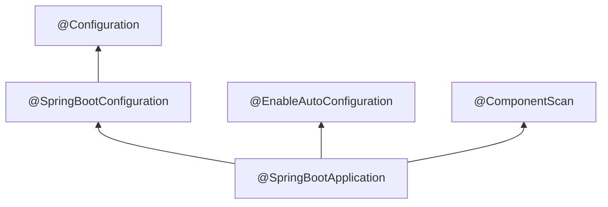
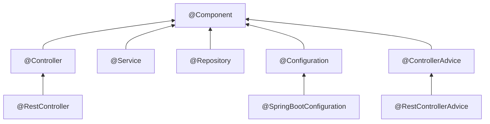
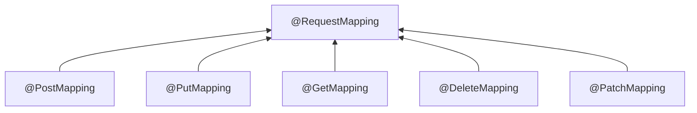

## 1 核心注解
`@SpringBootApplication`通常用于启动类上，申明让spring boot自动给程序进行必要的配置

```java
@Target({ElementType.TYPE})  
@Retention(RetentionPolicy.RUNTIME)  
@Documented  
@Inherited  
@SpringBootConfiguration  
@EnableAutoConfiguration  
@ComponentScan(  
    excludeFilters = {@Filter(  
    type = FilterType.CUSTOM,  
    classes = {TypeExcludeFilter.class}  
), @Filter(  
    type = FilterType.CUSTOM,  
    classes = {AutoConfigurationExcludeFilter.class}  
)}  
)  
public @interface SpringBootApplication {  
    @AliasFor(  
        annotation = EnableAutoConfiguration.class  
    )  
    Class<?>[] exclude() default {};  
  
    @AliasFor(  
        annotation = EnableAutoConfiguration.class  
    )  
    String[] excludeName() default {};  
  
    @AliasFor(  
        annotation = ComponentScan.class,  
        attribute = "basePackages"  
    )  
    String[] scanBasePackages() default {};  
  
    @AliasFor(  
        annotation = ComponentScan.class,  
        attribute = "basePackageClasses"  
    )  
    Class<?>[] scanBasePackageClasses() default {};  
  
    @AliasFor(  
        annotation = ComponentScan.class,  
        attribute = "nameGenerator"  
    )  
    Class<? extends BeanNameGenerator> nameGenerator() default BeanNameGenerator.class;  
  
    @AliasFor(  
        annotation = Configuration.class  
    )  
    boolean proxyBeanMethods() default true;  
}
```



- **@SpringBootConfiguration** :SpringBoot的配置类，表示一个类提供 Spring Boot 应用程序`@Configuration`。可以用作 Spring 标准`@Configuration`注释的替代方法，以便可以自动找到配置
	- **@Configuration**:标记类为配置类，等价于XML配置文件，通常与`@Bean`配合使用
	- **@EnableAutoConfiguration** :启用自动配置，根据项目依赖（如`spring-boot-starter-web`）自动配置Spring应用。也可以设置排除，如`@SpringBootApplication(exclude = {DataSourceAutoConfiguration.class})`可以不进行数据源的自动配置，防止出现一些加载顺序错误的问题
	- **@ComponentScan**：标注哪些路径下的类需要被Spring扫描，用于自动发现和装配一些Bean对象。如果出现Bean自动装配失败的情况，可以在这里手动添加Bean所在包的路径，如`@ComponentScan(basePackages = {"org.example.gateway", "org.example.common"})`


## 2 SpringMVC
### 2.1 @Component




- **@Component：** 标注Spring管理的Bean，使用@Component注解在一个类上，表示将此类标记为Spring容器中的一个Bean。当启用组件扫描时，Spring 会自动检测并注册这些类到 IoC 容器中，供依赖注入使用。
	- **@Controller**：用于定义控制器类，负责将用户请求转发到对应的服务接口，通常需要配合@RequestMapping使用。
	- **@Service**：用于标记业务逻辑层（Service）组件，无额外技术功能。
	- **@Repository**：用于修饰dao层的组件。

使用多个派生注解，而不是都用 @Component，可以提高代码可读性和维护性，明确类的作用层级。此外，某些注解(如 @Repository)会启用框架的额外功能。


>[!note] @Controller和@RestController的区别
>@Controller是传统的 MVC 控制器，用于返回视图(View)[^1]（如 JSP、Thymeleaf），@RestController专为 RESTful API[^2] 设计，直接返回数据（如 JSON/XML），无需视图解析。
>
>**@RestController=@Controller+@ResponseBody**
>
>另外，这种模式的还有@ControllerAdvice和@RestControllerAdvice等，它们之间的区别类似。


### 2.2 @RequestMapping


@RequestMapping用于将 HTTP 请求映射到 Spring MVC 控制器的处理方法上，支持定义请求路径、HTTP 方法、请求头等条件。

| 属性           | 说明                                        |
| ------------ | ----------------------------------------- |
| `value/path` | 指定请求路径（如 `/api/users`）。                   |
| `method`     | 指定 HTTP 方法（如 `RequestMethod.GET`）。        |
| `consumes`   | 限制请求的 Content-Type（如 `application/json`）。 |
| `produces`   | 指定响应的 Content-Type（如 `text/html`）。        |

Spring 4.3 后引入了更简洁的注解，针对不同 HTTP 方法提供直接支持，**本质是 @RequestMapping的语法糖**。

| 注解               | 等效                                               | 说明                           |
| ---------------- | ------------------------------------------------ | ---------------------------- |
| `@GetMapping`    | `@RequestMapping(method = RequestMethod.GET)`    | 处理 HTTP GET 请求，通常用于查询数据。     |
| `@PostMapping`   | `@RequestMapping(method = RequestMethod.POST)`   | 处理 HTTP POST 请求，通常用于创建资源。    |
| `@PutMapping`    | `@RequestMapping(method = RequestMethod.PUT)`    | 处理 HTTP PUT 请求，通常用于全量更新资源。   |
| `@DeleteMapping` | `@RequestMapping(method = RequestMethod.DELETE)` | 处理 HTTP DELETE 请求，删除资源。      |
| `@PathchMapping` | `@RequestMapping(method = RequestMethod.PATCH)`  | 处理 HTTP PATCH 请求，通常用于部分更新资源。 |


### 2.3 参数相关
#### 2.3.1 @PathVariable
- **用途**：从 **URI 路径模板** 中提取变量。
- **核心属性**：
    - `value`/`name`：指定路径变量名（默认与方法参数名一致）。
    - `required`：是否必须（默认 `true`）。
- **示例**：
```java
@GetMapping("/users/{id}")
public ResponseEntity<User> getUserById(
    @PathVariable("id") Long userId // 匹配路径中的 {id}
) {
    // 根据 userId 查询用户
}
```
- **常见问题**：
    - 路径变量名与方法参数名不一致时需显式指定 `value`。
    - 若 `required=true` 但未传递变量，抛出 `MissingPathVariableException`。
#### 2.3.2 @RequestParam
- **用途**：从 **URL 查询参数** 或 **表单数据** 中提取值。
- **核心属性**：
    - `value`/`name`：参数名（默认与方法参数名一致）。
    - `required`：是否必须（默认 `true`）。
    - `defaultValue`：默认值（自动将 `required` 设为 `false`）。
- **示例**：
```java
@GetMapping("/users")
public ResponseEntity<List<User>> searchUsers(
    @RequestParam(value = "name", required = false) String name,
    @RequestParam(defaultValue = "0") int page
) {
    // 根据 name 和 page 分页查询用户
}
```
- **常见场景**：
    - 分页参数（如 `page=1&size=10`）。
    - 筛选条件（如 `name=Alice&role=admin`）。
#### 2.3.3 @RequestBody
- **用途**：将 **HTTP 请求体**（如 JSON、XML）反序列化为 Java 对象。
- **支持格式**：需配合 `Content-Type`（如 `application/json`）。
- **示例**：
```java
@PostMapping("/users")
public ResponseEntity<User> createUser(
    @RequestBody User user // 自动将请求体 JSON 转换为 User 对象
) {
    User savedUser = userService.save(user);
    return ResponseEntity.ok(savedUser);
}
```
- **注意事项**：
    - 通常用于 `POST`、`PUT` 请求。
    - 需引入 JSON 解析库（如 Jackson）。
    - 若请求体格式错误，抛出 `HttpMessageNotReadableException`。

>[!note] @ResponseBody
>@ResponseBody注解表示方法的返回值应该直接写入 HTTP 响应体中，而不是被解析为视图。它告诉 Spring MVC 框架将方法的返回值序列化为特定格式（如 JSON、XML 等）并作为响应的主体内容返回给客户端。

#### 2.3.4 @RequestPart
- **用途**：处理 **`multipart/form-data`** 请求中的部分数据（如文件上传和其他表单字段）。
- **核心属性**：
    - `value`/`name`：指定表单字段名（默认与方法参数名一致）。
    - `required`：是否必须（默认 `true`）。
- **示例**（文件上传）：
```java
@PostMapping(value = "/upload", consumes = MediaType.MULTIPART_FORM_DATA_VALUE)
public String uploadFile(
    @RequestPart("file") MultipartFile file,         // 接收上传的文件
    @RequestPart("metadata") FileMetaData metadata   // 接收 JSON 格式的元数据
) {
    fileService.save(file, metadata);
    return "Upload success!";
}

// FileMetaData 类
public class FileMetaData {
    private String description;
    private String category;
    // Getter/Setter
}
```

- **与 `@RequestBody` 的区别**：

| **对比项**          | `@RequestBody`             | `@RequestPart`        |
| ---------------- | -------------------------- | --------------------- |
| **请求类型**         | 非 `multipart`（如 JSON/XML）  | `multipart/form-data` |
| **数据绑定**         | 整个请求体反序列化为单一对象             | 处理多个部分（如文件 + JSON 字段） |
| **Content-Type** | 统一指定（如 `application/json`） | 各部分可独立指定 Content-Type |

- **常见场景**：
    - 上传文件并附带元数据（如图片描述）。
    - 同时提交表单字段和二进制数据。
- **注意事项**：
    - 需在配置中启用 Multipart 支持（Spring Boot 默认已配置）。
    - 大文件需配置 `spring.servlet.multipart.max-file-size`。

#### 2.3.5 @ModelAttribute
- **用途**：将 **请求参数（表单数据或查询参数）** 绑定到 Java 对象，常用于传统 MVC 表单提交。
- **两种用法**：
    1. **方法参数绑定**：将请求参数填充到对象字段。
    2. **方法级别**：在控制器方法执行前，自动将对象添加到模型（Model）中供视图使用。
- **示例**：
```java
// 提交表单：POST /register (name=Alice&age=25)
@PostMapping("/register")
public String registerUser(
    @ModelAttribute UserForm userForm // 自动绑定表单字段到 UserForm 对象
) {
    userService.register(userForm);
    return "success";
}

// UserForm 类
public class UserForm {
    private String name;
    private int age;
    // Getter/Setter
}
```
- **方法级别示例**：
```java
@ModelAttribute("currentUser")
public User addCurrentUser() {
    return userService.getCurrentUser(); // 自动添加到 Model，视图可通过 ${currentUser} 访问
}
```
- **与 `@RequestParam` 的区别**：

| **对比项**   | `@RequestParam` | `@ModelAttribute` |
| --------- | --------------- | ----------------- |
| **绑定目标**  | 单个参数            | 对象（多个字段自动填充）      |
| **适用场景**  | 少量简单参数          | 复杂表单数据（如用户注册表单）   |
| **代码简洁性** | 需逐个声明参数         | 自动将表单字段映射到对象属性    |

- **注意事项**：
    - 对象必须有默认构造函数和字段的 Setter 方法。
    - 支持级联绑定（如 `user.address.city`）。

#### 2.3.6 @RequestHeader
- **用途**：从 **HTTP 请求头** 中提取值。
- **核心属性**：
    - `value`/`name`：请求头名称（如 `User-Agent`）。
    - `required`：是否必须（默认 `true`）。
    - `defaultValue`：默认值。
- **示例**：
```java
@GetMapping("/info")
public ResponseEntity<String> getClientInfo(
    @RequestHeader("User-Agent") String userAgent, // 获取客户端浏览器信息
    @RequestHeader(value = "X-Custom-Header", defaultValue = "default") String customHeader
) {
    // 处理请求头信息
}
```
- **常见场景**：
    - 身份验证（如 `Authorization` 头）。
    - 客户端信息采集（如设备类型、语言）。


## 3 依赖注入
| 注解           | 标准      | 注入方式      | 解决歧义性方法      | 适用场景               |
| ------------ | ------- | --------- | ------------ | ------------------ |
| `@Autowired` | Spring  | `byType`  | `@Qualifier` | 大多数场景，优先构造方法注入     |
| `@Resource`  | JSR-250 | `byName`  | `name` 属性    | 需要按名称明确指定时         |
| `@Inject`    | JSR-330 | `byType`  | `@Named`     | 兼容 Java EE 环境      |
| `@Qualifier` | Spring  | `byName`  | 直接指定名称       | 配合 `@Autowired` 使用 |
| `@Primary`   | Spring  | 标记首选 Bean | 无            | 简化多 Bean 的默认选择     |
| `@Lazy`      | Spring  | 延迟初始化     | 无            | 优化性能或解决循环依赖        |

### 3.1 Spring标准注解
#### 3.1.1 @Autowired
按类型（byType）自动注入依赖，适用于字段、构造方法、Setter 方法或普通方法。若存在多个同类型 Bean，需结合 @Qualifier指定名称。

默认​**​必须存在匹配的 Bean​**​，否则抛出异常。但是可通过 `required = false` 允许注入 null（慎用）。

```java
@Service
public class UserService {
    @Autowired
    private UserRepository userRepository;
}

// 推荐使用构造方法注入(强制依赖)
@Service
public class UserService {
    private final UserRepository userRepository;
    
    @Autowired // Spring 4.3+ 可省略
    public UserService(UserRepository userRepository) {
        this.userRepository = userRepository;
    }
}

// 也可以使用Setter方法注入(可选依赖)
@Autowired
public void setUserRepository(UserRepository userRepository) {
    this.userRepository = userRepository;
}
```

#### 3.1.2 @Qualifier 
解决 @Autowired按类型注入时的歧义性（多个同类型 Bean 存在时），按名称（byName）明确指定注入的 Bean。

当一个接口有多个实现类时，需通过 ​**​Bean 名称​**​ 指定具体实现。

```java
// 定义两个实现类
@Repository("mysqlUserRepo")
public class MySQLUserRepository implements UserRepository { ... }

@Repository("mongoUserRepo")
public class MongoDBUserRepository implements UserRepository { ... }

// 注入时指定名称
@Service
public class UserService {
    @Autowired
    @Qualifier("mysqlUserRepo")  // 明确指定 Bean 名称
    private UserRepository userRepository;
}
```

#### 3.1.3 @Primary
标记某个 Bean 为​**​首选项​**​，当存在多个同类型 Bean 时，优先注入被@Primary标记的 Bean。

```java
@Configuration
public class AppConfig {
    @Bean
    @Primary  // 标记为首选 Bean
    public UserRepository mysqlUserRepo() {
        return new MySQLUserRepository();
    }

    @Bean
    public UserRepository mongoUserRepo() {
        return new MongoDBUserRepository();
    }
}

// 注入时自动选择 @Primary 的 Bean
@Service
public class UserService {
    @Autowired  // 自动注入 mysqlUserRepo
    private UserRepository userRepository;
}
```


#### 3.1.4 @Lazy
延迟初始化 Bean，直到首次被使用时才创建。

作用：
- 优化启动性能，避免初始化耗时较长的 Bean。
- 解决循环依赖问题（结合@Autowired使用）。

```java
@Service
public class UserService {
    @Lazy
    @Autowired
    private HeavyResource heavyResource;  // 首次调用时初始化
}
```

>[!note] 解决循环依赖原理
>1. 当Spring容器启动时，会解析并创建所有的Bean定义，但不会立即初始化Bean实例。
>2. 当遇到循环依赖时，Spring会创建一个代理对象来代替其中一个Bean的实例。
>3. 通过@Lazy注解，可以指定某个Bean在第一次被使用时才进行初始化，而不是在容器启动时立即初始化。
>4. 当另一个Bean依赖于被@Lazy注解修饰的Bean时，Spring会返回一个代理对象，而不是实际的Bean实例。
>5. 当代理对象被调用时，Spring会检查是否需要初始化被@Lazy注解修饰的Bean。
>6. 如果需要初始化，Spring会解析并创建被@Lazy注解修饰的Bean，并将其注入到代理对象中。
>7. 这样，循环依赖问题得到了解决，每个Bean都能够正确地获取到对方的实例。

### 3.2 JSR标准注解
#### 3.2.1 @Resource
按名称（byName）注入依赖，是 ​**​JSR-250​**​ 标准注解，支持 JDK 原生环境。

默认按名称匹配，若未找到则回退到按类型匹配。可通过 `name` 属性直接指定 Bean 名称，`type` 属性指定类型。

```java
@Service
public class UserService {
    // 按名称注入
    @Resource(name = "mysqlUserRepo")
    private UserRepository userRepository;

    // 按类型注入（若名称未匹配，则回退到类型）
    @Resource
    private UserRepository defaultUserRepo;
}
```
#### 3.2.2 @Inject
与 @Autowired功能类似，但属于 ​**​JSR-330​**​ 标准（需引入 `javax.inject` 依赖）。

特点：
- 支持@Named注解指定 Bean 名称（类似@Qualifier）。​
- **​无 required属性​**​，若未找到 Bean 则直接抛出异常。

```java
// 引入依赖（Maven）
<dependency>
    <groupId>javax.inject</groupId>
    <artifactId>javax.inject</artifactId>
    <version>1</version>
</dependency>

// 使用 @Inject
@Service
public class UserService {
    @Inject
    @Named("mysqlUserRepo")  // JSR-330 的 @Named 注解
    private UserRepository userRepository;
}
```

## 4 数据持久层
### 4.1 Spring Data JPA ORM
JPA（Java Persistence API）是 Java 的持久化规范，Spring Data JPA 在其基础上进一步简化了数据访问层开发。

```java

@Entity // 标记类为 JPA 实体，对应数据库中的一张表

// 自定义实体与数据库表的映射关系，name属性指定表名(默认与实体类名一致，驼峰转下划线)，schema指定数据库模式，indexes定义表索引
@Table(name = "users", schema = "public", indexes = ...) 
public class User {  
	@Id // 标记字段为主键
	@GeneratedValue(strategy = GenerationType.IDENTITY) // 定义主键生成策略：INDENTITY,SEQUENCE,TABLE,AUTO
    private Integer id;  
  

	/** 自定义字段与数据库列的映射，name：列名（默认与字段名相同）；nullable：是否允许为NULL（默认true）；length：字符串类型字段长度（默认 255）；unique：是否唯一约束；columnDefinition：自定义列定义（如TEXT、BIGINT）。
	*/
	@Column(name = "user_name", nullable = false, length = 50) 
    private String nickname;  
  
    
    private String password;  
  
    
    private String phone;  
  
    
    private String gender;  
  

	@Transient // 标记字段不持久化到数据库
    private String avatar;  

	// 映射枚举类型字段，枚举存储方式：EnumType.STRING：存储枚举名称（推荐）；EnumType.ORDINAL`：存储枚举序号（不推荐，易受顺序影响）。
	@Enumerated(EnumType.STRING) 
	private UserRole role; // 数据库存储 "ADMIN", "USER" 等

	/** 映射java.util.Date或java.util.Calendar类型。TemporalType.DATE：仅存储日期（如2023-10-01）。TemporalType.TIME：仅存储时间（如14:30:00）。TemporalType.TIMESTAMP：存储日期和时间（默认）。
	*/
	@Temporal(TemporalType.TIMESTAMP)
    private LocalDateTime registerDate;  
}
```


### 4.2 MyBatis & MyBatis Plus
| 特性              | MyBatis       | MyBatis Plus                  |
| --------------- | ------------- | ----------------------------- |
| ​**​CRUD 操作​**​ | 需手动编写 SQL 或注解 | 内置通用 CRUD 方法（继承 `BaseMapper`） |
| ​**​条件构造器​**​   | 无             | 支持 `QueryWrapper` 动态构建条件      |
| ​**​分页插件​**​    | 需手动配置         | 内置分页插件，配置简单                   |
| ​**​乐观锁​**​     | 需手动实现         | 通过 `@Version` 注解自动支持          |
| ​**​代码生成器​**​   | 无             | 提供代码生成器，快速生成实体类、Mapper 等文件    |
| ​**​逻辑删除​**​    | 需自定义逻辑        | 通过 `@TableLogic` 注解一键配置       |
#### 4.2.1 数据库操作
##### 4.2.1.1 CRUD
```java
@Mapper
public interface UserMapper {
    @Select("SELECT * FROM user WHERE id = #{id}")
    User getUserById(Long id);

    @Insert("INSERT INTO user(name, age) VALUES(#{name}, #{age})")
    int insertUser(User user);

    @Update("UPDATE user SET name=#{name}, age=#{age} WHERE id=#{id}")
    int updateUser(User user);

    @Delete("DELETE FROM user WHERE id = #{id}")
    int deleteUser(Long id);
}
```


>[!note]  @Mapper和@Repository的区别
>@Mapper是MyBatis框架的注解，标记 MyBatis 的 Mapper 接口，由 MyBatis 动态生成实现类，绑定 SQL 映射。
>@Repository是Spring(Spring Data JPA)框架的注解，标记数据访问层（DAO）类，整合到 Spring 容器，提供异常转换和 Bean 管理。
>

##### 4.2.1.2 结果集映射
自定义结果集映射，解决数据库字段与实体类属性名不一致的问题

```java
@Select("SELECT id, user_name, user_age FROM user")
@Results({
    @Result(property = "id", column = "id"),
    @Result(property = "name", column = "user_name"),
    @Result(property = "age", column = "user_age")
})
List<User> getAllUsers();
```

##### 4.2.1.3 动态sql
**@SelectProvider​**​ / ​**​@InsertProvider​**​ / ​**​@UpdateProvider​**​ / ​**​@DeleteProvider​**​：  通过 Provider 类动态生成 SQL。

```java
public class UserSqlProvider {
    public String getUserByName(String name) {
        return new SQL()
            .SELECT("*")
            .FROM("user")
            .WHERE("name = #{name}")
            .toString();
    }
}

@SelectProvider(type = UserSqlProvider.class, method = "getUserByName")
User getUserByName(String name);
```
​​
##### 4.2.1.4 参数处理
**@Param​**​: 为方法参数命名，用于多参数或复杂参数场景。
```java
@Select("SELECT * FROM user WHERE name = #{name} AND age = #{age}")
User getUserByNameAndAge(@Param("name") String name, @Param("age") int age);
```

>[!note] 必须使用的场景
>1. 方法有多个参数
>2. 当需要给参数取一个别名时
>3. XML 中的 SQL 使用了`$`，那么参数中也需要 @Param 注解
>4. 动态 SQL ，如果在动态 SQL 中使用了参数作为变量，那么也需要 @Param 注解，即使只有一个参数

>[!tip] 
>有的时候，多个参数不加@Param也不会报错，是因为IDEA编译时采取了**强制保持方法参数变量名**，但需要jdk1.8及以上且编译器参数"-parameters"

#### 4.2.2 ORM

```java
@TableName("user")  // 指定实体类对应的数据库表名（默认类名驼峰转下划线）
public class User {  
    @TableId(value = "id", type = IdType.AUTO)  // 标识主键字段，支持主键生成策略
    private Integer id;  

	// 指定非主键字段的映射关系
	@TableField(value = "user_name", exist = true)  // exist=false 表示非数据库字段
    private String nickname;  

    private String password;  

    private String phone;  

    private String gender;  
  
    private String avatar;  
  
    private LocalDateTime registerDate;  
}
```

### 4.3 @Transactional
@Transactional是 Spring 框架中用于声明式事务管理的核心注解，它可以将**方法或类**标记为需要事务支持，简化事务的开启、提交、回滚等操作。

1. ​**​事务范围​**​：
    - ​**​方法级别​**​：标注在方法上，仅对该方法生效。
    - ​**​类级别​**​：标注在类上，对该类中所有 `public` 方法生效。
2. ​**​传播行为（Propagation）​**​：  
    定义事务如何传播到其他方法（如嵌套事务）。
    - ​**​常用传播行为​**​：
        - `REQUIRED`（默认）：当前存在事务则加入，否则新建事务。
        - `REQUIRES_NEW`：始终新建事务，挂起当前事务（独立提交或回滚）。
        - `SUPPORTS`：当前存在事务则加入，否则非事务运行。
        - `NOT_SUPPORTED`：非事务运行，挂起当前事务。
        - `NEVER`：非事务运行，若存在事务则抛出异常。
3. ​**​隔离级别（Isolation）​**​：  
    控制事务间的数据可见性，解决脏读、不可重复读、幻读等问题。
    - ​**​常用隔离级别​**​：
        - `DEFAULT`：使用数据库默认隔离级别（如 MySQL 默认为 `REPEATABLE_READ`）。
        - `READ_UNCOMMITTED`：允许读取未提交的数据（可能脏读）。
        - `READ_COMMITTED`：只能读取已提交的数据（解决脏读）。
        - `REPEATABLE_READ`：确保同一事务中多次读取结果一致（解决不可重复读）。
        - `SERIALIZABLE`：完全串行化执行（解决幻读，性能最低）。
4. ​**​回滚规则​**​：
    - `rollbackFor`：指定触发回滚的异常类型（默认回滚 `RuntimeException` 和 `Error`）。
    - `noRollbackFor`：指定不触发回滚的异常类型。
5. ​**​其他属性​**​：
    - `timeout`：事务超时时间（秒），超时自动回滚。
    - `readOnly`：是否只读事务（优化数据库性能，默认 `false`）。

```java
@Service
public class OrderService {
    @Autowired
    private OrderRepository orderRepository;

    @Transactional
    public void createOrder(Order order) {
        orderRepository.save(order);
        // 若抛出 RuntimeException，事务自动回滚
    }
}
```

## 5 配置与属性
### 5.1 配置

```java
import org.springframework.context.annotation.*;
import javax.sql.DataSource;
import java.util.HashMap;
import java.util.Map;

@Configuration // 标记一个类为配置类​，替代传统XML配置文件，内部通过@Bean方法定义Bean。
@Order(-1) // 配置类加载优先级（值越小越优先）
@PropertySource("classpath:datasource.properties") // 加载外部配置文件
public class AppConfig {

    /​**​
     * 配置数据源 Bean（高优先级）
     * 通过 @Bean 注解将方法返回值注册为 Spring 管理的 Bean
     */
    // 标注在方法上，声明该方法返回的对象由Spring容器管理。name：指定 Bean 的名称（默认与方法名相同）。initMethod/destroyMethod定义初始化和销毁方法。
    @Bean(name = "dataSource") 
    @Primary // 标记为首选数据源
    public DataSource dataSource() {
        // 模拟 HikariCP 数据源配置
        HikariDataSource dataSource = new HikariDataSource();
        dataSource.setJdbcUrl("jdbc:mysql://localhost:3306/mydb");
        dataSource.setUsername("root");
        dataSource.setPassword("123456");
        dataSource.setMaximumPoolSize(20);
        return dataSource;
    }

    /​**​
     * 初始化系统参数 Bean（依赖数据源）
     * 使用 @DependsOn 确保数据源优先初始化
     */
    @Bean
    @DependsOn("dataSource") // 显式声明依赖关系
    public Map<String, String> systemParams(DataSource dataSource) {
        Map<String, String> params = new HashMap<>();
        // 模拟从数据库加载参数
        params.put("app.name", "SpringBoot Demo");
        params.put("app.version", "1.0.0");
        return params;
    }

    /​**​
     * 自定义 Bean 的初始化与销毁方法
     */
    @Bean(initMethod = "init", destroyMethod = "cleanup")
    public CacheService cacheService() {
        return new CacheService();
    }
}

/​**​
 * 模拟缓存服务类
 */
class CacheService {
    public void init() {
        System.out.println("CacheService initialized.");
    }

    public void cleanup() {
        System.out.println("CacheService destroyed.");
    }
}
```


### 5.2 属性
#### 5.2.1 @Value
注入`application.properties`或`application.yml`中的配置值，支持`${key}`表达式

```java
@Value("${server.port}")  
private String port;  
```

#### 5.2.2 @ConfigurationProperties
批量绑定配置文件中的属性到Java对象，支持类型安全校验，需指定前缀

```java
@ConfigurationProperties(prefix = "datasource")  
public class DataSourceConfig { ... }  
```

#### 5.2.3 @PropertySource
加载自定义配置文件（如`.properties`或`.yml`）

```java
	// 组件bean
@Component
  @PropertySource("classpath:db.properties")
  public class DBConnection {

    @Value("${DB_DRIVER_CLASS}")
    private String driverClass;

    @Value("${DB_URL}")
    private String dbUrl;

    @Value("${DB_USERNAME}")
    private String userName;

    @Value("${DB_PASSWORD}")
    private String password;

    public DBConnection(){}

    public void printDBConfigs(){
      System.out.println("Db Driver Class = " + driverClass);
      System.out.println("Db url = " + dbUrl);
      System.out.println("Db username = " + userName);
      System.out.println("Db password = " + password);
    }
  }

```
#### 5.2.4 @Profile
指定配置类或Bean在特定环境下生效（如`dev`/`prod`）。

```java
@Profile("dev")  
@Service  
public class DevService { ... }  
```

#### 5.2.5 @ConditionalOnProperty
根据配置属性是否存在或值决定是否创建Bean。

```java
@ConditionalOnProperty(name = "cache.enabled", havingValue = "true")  
@Bean  
public CacheService cacheService() { ... }  
```

## 6 异常
**@ControllerAdvice** ：结合`@ExceptionHandler`实现全局异常处理。
```java
@ControllerAdvice
public class GlobalExceptionHandler {
    @ExceptionHandler(Exception.class) // 这里是要处理的异常类的字节码文件
    public Result<String> handleException(Exception e) { ... }
}
```

## 7 测试
### 7.1 测试框架与工具

| **工具/框架**            | **用途**                                                  |
| -------------------- | ------------------------------------------------------- |
| **JUnit 5**          | 测试运行框架，支持 `@Test`、`@BeforeEach`、`@AfterEach` 等注解。       |
| **Spring Boot Test** | 提供 `@SpringBootTest`、`@WebMvcTest` 等注解，简化 Spring 上下文加载。 |
| **Mockito**          | 创建和管理 Mock 对象，用于依赖隔离。                                   |
| **Testcontainers**   | 启动 Docker 容器（如数据库），用于集成测试。                              |
| **AssertJ**          | 提供流畅的断言语法，增强测试可读性。                                      |
| **JSONAssert**       | 验证 JSON 数据的结构和内容。                                       |
### 7.2 单元测试

#### 7.2.1 纯业务逻辑测试
**不依赖 Spring 上下文**，仅测试类本身。

创建完成一个方法，方法头上加一个@Test 注解，旁边就会出现一个绿色的启动标记 ，点击运行，可以看到**没有main方法也是可以启动单元**的。
```java
public class TestDemo {
    @Test
    public void show(){
        System.out.println("Test单元测试");
    }
}

```

#### 7.2.2 使用 Mockito 模拟依赖
**场景**：测试 Service 层，隔离数据库或外部服务。
```java
class UserServiceTest {
    @Mock
    private UserRepository userRepository;
    @InjectMocks
    private UserService userService;

    @BeforeEach
    void setup() {
        MockitoAnnotations.openMocks(this);
    }

    @Test
    void findUserById_WhenExists_ReturnsUser() {
        User mockUser = new User(1L, "Alice");
        when(userRepository.findById(1L)).thenReturn(Optional.of(mockUser));

        User result = userService.findUserById(1L);
        assertThat(result.getName()).isEqualTo("Alice");
    }
}
```

### 7.3 集成测试
#### 7.3.1 全上下文测试@SpringBootTest
**启动完整 Spring 上下文**，适合端到端测试。
```java
@SpringBootTest(webEnvironment = SpringBootTest.WebEnvironment.RANDOM_PORT)
class UserControllerIntegrationTest {
    @Autowired
    private TestRestTemplate restTemplate;

    @Test
    void getUserById_ReturnsUser() {
        ResponseEntity<User> response = restTemplate.getForEntity("/users/1", User.class);
        assertThat(response.getStatusCode()).isEqualTo(HttpStatus.OK);
        assertThat(response.getBody().getName()).isEqualTo("Alice");
    }
}
```

#### 7.3.2 切片测试（Slice Test）
**仅加载部分上下文**，提升测试速度。

| **注解**            | **用途**             | **示例场景**                      |
| ----------------- | ------------------ | ----------------------------- |
| `@WebMvcTest`     | 仅加载 Web MVC 相关组件   | 测试 Controller 层逻辑             |
| `@DataJpaTest`    | 仅加载 JPA 组件，嵌入内存数据库 | 测试 Repository 层数据库操作          |
| `@JsonTest`       | 仅加载 JSON 序列化相关组件   | 验证 JSON 序列化/反序列化逻辑            |
| `@RestClientTest` | 仅加载 REST 客户端相关组件   | 测试 `RestTemplate` 或 Feign 客户端 |


## 8 其它
### 8.1 数据校验


### 8.2 跨域


---

[^1]: 负责数据的展示与用户交互界面，是用户直接看到的部分（如网页、移动端页面）。通常由 HTML/CSS/JavaScript 或模板引擎（如 Thymeleaf、JSP、Freemarker）生成。 在 MVC 架构中，视图从控制器（Controller） 接收数据，并渲染成最终界面。`<!-- Thymeleaf 视图模板示例 -->``<h1 th:text="${user.name}">用户名</h1>``<p th:text="${user.email}">用户邮箱</p>`

[^2]: RESTful API是一种基于 **REST（Representational State Transfer）** 架构风格设计的接口，用于系统间通过 HTTP 协议进行资源交互。其核心特点：1.资源为中心:将数据或服务抽象为资源（如 `/users`、`/products`），通过 URI（统一资源标识符） 定位。2.HTTP 方法明确操作 :使用标准 HTTP 方法定义行为：`GET`（查询）; `POST`（新增）; `PUT`/`PATCH`（更新）; `DELETE`（删除）3.无状态通信: 每个请求独立，服务端不保存客户端状态（如会话），依赖请求自身信息处理。4.数据格式标准化:  通常返回 **JSON** 或 **XML** 格式数据，通过状态码（如 `200 OK`、`404 Not Found`）明确结果。