MYSQL 9.2.0

数据库索引好比是一本书前面的目录，能加快数据库的查询速度。  当数据库中数据量很大时，查找数据会变得很慢，我们就可以通过索引来提高数据库的查询效率。而MYSQL当中默认的存储引擎为InnoDB，而索引与其高度相关，所以接下来讲解其有关内容。

**InnoDB**

InnoDB 以每次与磁盘交互为16kb，而InnoDB将这16kb划分成其最小的单位“页”，所有数据操作（增删改查）均通过页完成。
数据按页连续存储在磁盘上。

在磁盘当中，当某个数据被访问时，其物理相邻的数据大概率会被随后访问（如遍历数组、范围查询），因为内存的效率和磁盘的效率差了几个数量级，所以为了优化效率这些相邻的数据会优先加载到寄存器或者主存当中（空间局部性），以便减少磁盘 I/O 次数。又由于InnoDB在，这些相邻页的访问具有天然的空间局部性。

InnoDB在设计当中会在页当中设置两种伪记录，下面时一个页存储内容的概况

主键索引:每个的页以单向链表的形式存储，若不设置主键，MYSQL会自动令UNIQUE键作为主键，如果连UNIQUE键都不存在，会插入一条看不到的名为DB_ROW_ID的列作为默认主键

为了加快查询的效率，减少遍历的次数，将记录的条数按照主键从小到大排列，并且将条数分组组成槽，记录每一个组当中最大的值的地址，

规则:

InnoDB会在存储地址的数据当中存储n_owned来存储每个组所记录的条数，这样就可以精准的比较大小和查询数据了

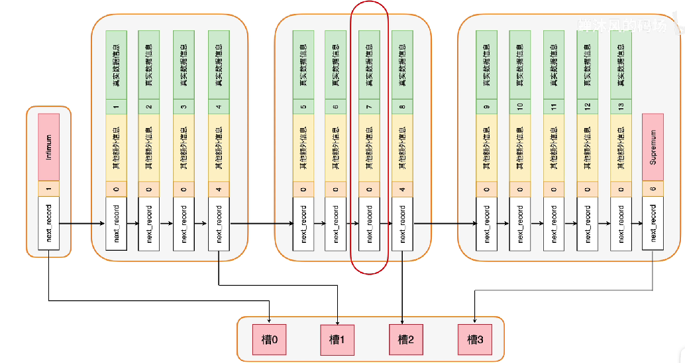

查询过程：通过二分法，去掉槽0与槽3，最后通过槽1直接定位到ID为7的数据

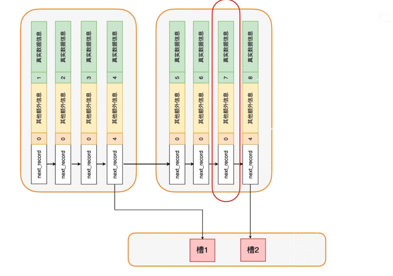

这是一个页，那么一个页不够用了怎么办？

那么会再生成一个页，这这些页会以双向链表的形式存储起来

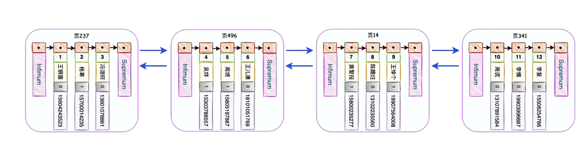

那么这一个一个的页时怎么记录的呢？

InnoDB会将这一个一个的页记录，并将页数从左到右的顺序记录到数据页当中，数据页用双向链表链接，一个不够再加一个。数据页过多再生成一个数据页的目录页.........

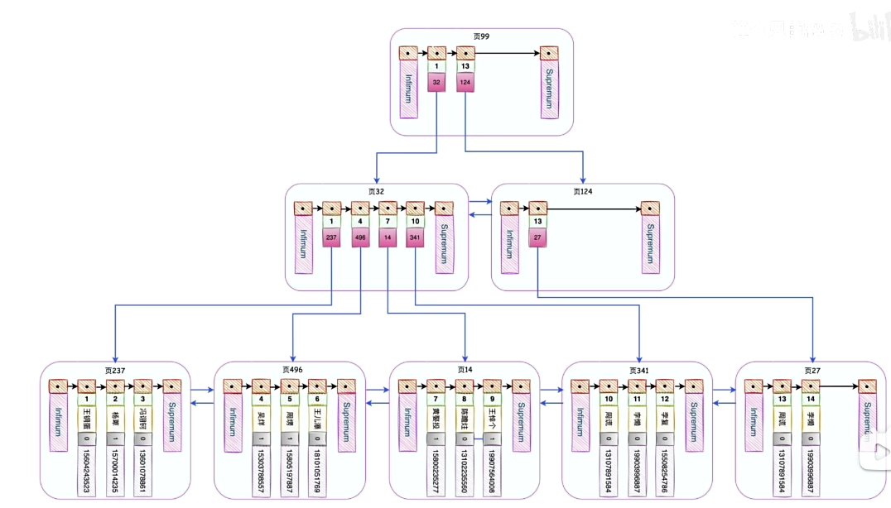

这个结构就是B+树,这个索引时InnoDB在存储数据时自动生成的，而这个索引叫做唯一索引，又叫作聚簇索引，每一个B+树最上面的节点叫做根节点，最下面的节点叫做叶子节点，这个结构当中，叶子节点存储完整的数据（索引即数据，数据即索引），其InnoDB搜索操作都会在主键索引的B+树上展开。

普通索引&&二级索引

普通索引会创造一个新的B+树，而这个B+树会按照列当中的数据进行排序，而叶子节点当中仅仅记录自己和主键。然后通过主键（这里的普通索引又可以叫做叫做二级索引）回表到主键索引（一级索引）查询其他数据。

联合索引：

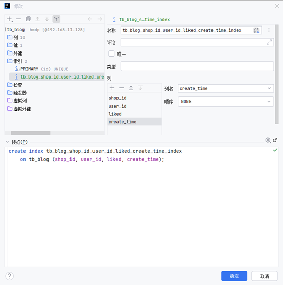

其与上面相同，行数据按照顺序依次排列，最后为主键索引。

索引这么NB，我把所有的行都设置一个索引不行吗？

1.索引的创建需要生成一个新的B+树，会占据更多的内存

2.每次增删改查会对有关索引造成修改都会有性能损失，甚至会触发数据页的回收与分裂，

3.MSYQL优化器会计算每个索引的搜索成本，多余的索引又会影响性能

回表：

由于是按照行数据排序的，所以主键是无序的，在回表过程当中的主键不连续，存储空间也不连续，回表会造成随机IO，甚至会重新从磁盘中重新读取数据。

减少回表的操作：

索引覆盖：如果通过普通索引或者联合索引直接获取所有需要的数据，不需要进行回表的操作。

ICP（索引下推）：在索引扫描过程中，直接对索引中的字段应用查询条件，过滤掉不满足条件的数据行，避免将这些行返回给上层（server）处理以及进行不必要的回表操作。

ICP的触发:

查询条件需包含**索引字段**和**非索引字段**。

索引需覆盖至少部分查询条件。

MySQL 优化器认为 ICP 比传统流程更高效。

索引失效:

如果索引了多列(联合索引),要遵循”最左前缀法则“

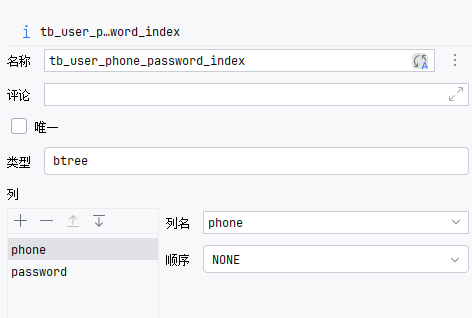

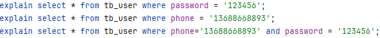

这里第一个搜索索引失效了。

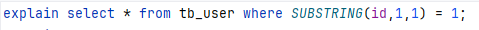

对索引列使用函数运算(非聚合函数)例如SUBSTRING(),ceil(),floor()......等等，因为内容要上传到server层，索引失效

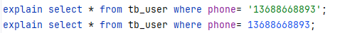

字符串类型使用不用单引号，索引失效。

模糊匹配在头部，索引失效。

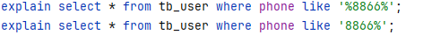

使用or时，两侧都有索引，索引失效。

`explain select * from tb_user where update_time > '2022-01-01 00:00:00' and create_time < '2023-01-01 00:00:00';`

如果mysql认为全表扫描更快，索引失效.(sql提示)
优化:

1.不为离散度低的列创建索引

2.只为搜索排序或者分组的列创作索引（利用好索引覆盖）

3.充分利用联合索引
4.对长字段建立前缀索引

5.频繁更新的列不要作为主键或者索引

Explain+DQL以展示查询执行过程

**TYPE类型**

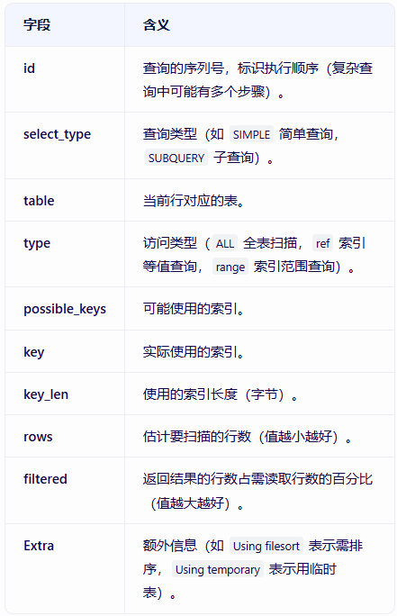

**MYISAM**

MyISAM 虽然数据查找性能极佳，但是不支持事务处理，也仅支持表锁不能支持行锁。

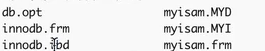

Innodb 创建表后生成的文件有：

—frm:创建表的语句  

—idb:表里面的数据+索引文件  

Myisam 创建表后生成的文件有

—frm:创建表的语句  

—MYD:表里面的数据文件

—MYI:表里面的索引文件

MyISAM 用的是非聚集索引方式，即数据和索引落在不同的两个文件上。MyISAM 在建表时以主键作为 KEY 来建立主索引 B+树，树的叶子节点存的是对应数据的物理地址。我们拿到这个物理地址后，就可以到 MyISAM 数据文件中直接定位到具体的数据记录了。

  从生成的文件看来，这两个引擎底层数据和索引的组织方式并不一样，MyISAM 引擎把数据和索引分开了，一人一个文件，这叫做非聚集索引方式

主键索引和二级索引在结构上没有任何区别，只是主键索引要求key是唯一的，而二级索引的key可以重复，叶子节点存储主键的逻辑值。如果我们在建立一个二级索引，则此索引的结构如下图所示:

**Memory**

内存表的数据部分以数组的方式单独存放，而主键 id 索引里，存的是每个数据的位置。主键 id 是 hash 索引，可以看到索引上的 key 并不是有序的。

1.InnoDB表索引总是有序存放的，而Memory表索引按插入顺序存放
2.当数据文件有空洞的时候，InnoDB为保持有序只能在固定位置插入值，而Memory找到空位就可以插入。
3.数据位置发生变化时，InnoDB只需修改主键索引，而Memory需要修改全部索引。
4.InnoDB主键索引需要查找一次索引，普通索引需要查找两次索引。而Memory中所有索引的地位都是相同的。
5.InnoDB支持变长数据类型，不同记录的长度可能不同。内存表不支持 Blob 和 Text 字段，并且即使定义了 varchar(N)，实际也当作 char(N)，也就是固定长度字符串来存储，因此内存表的每行数据长度相同。

### 内存表也支持B-Tree索引

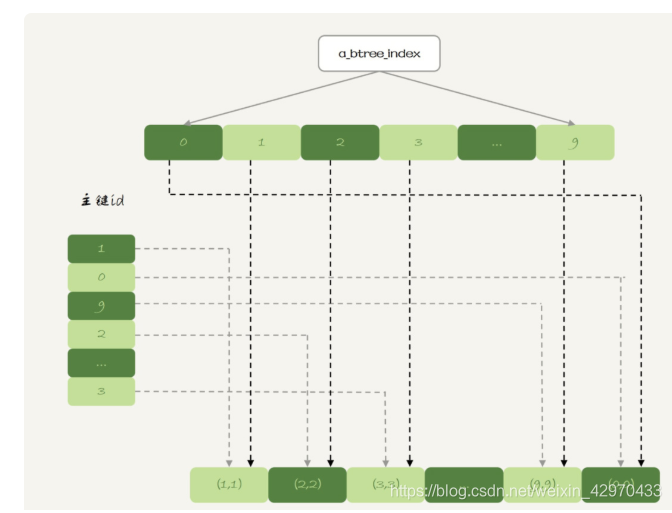

B树索引在内存表中的实现遵循经典B树结构，但针对内存特性做了优化：

1. **节点结构**：
   * 每个节点包含多个键值对和子节点指针
   * 内存表节点不需要磁盘预读，因此节点大小可动态调整（通常设为CPU缓存行大小的整数倍，如64B或128B）
2. **自平衡机制**：
   * 插入/删除时自动分裂/合并节点
   * 内存操作无磁盘I/O开销，平衡操作效率比磁盘表高3-5个数量级
3. **并发控制**：
   * 通常采用无锁结构或乐观锁
   * 通过原子操作保证线程安全

